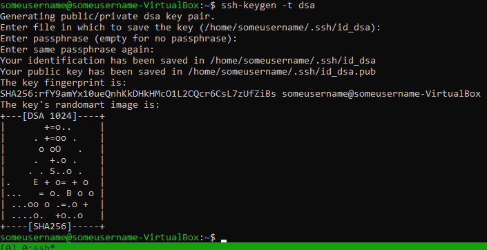
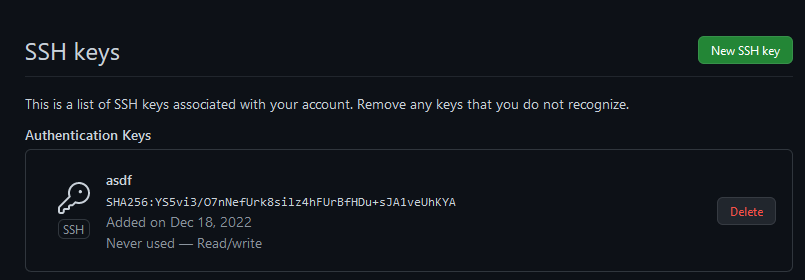
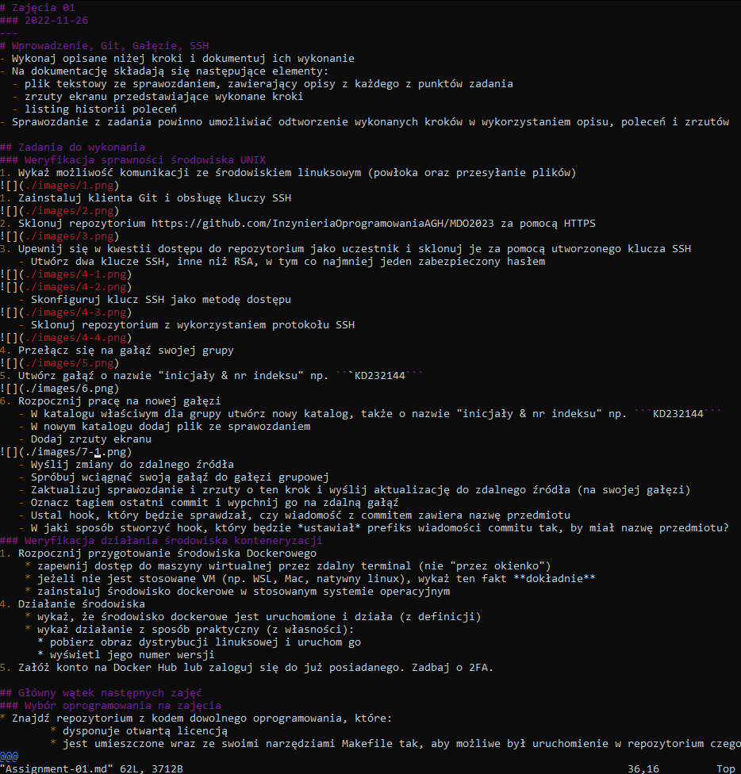
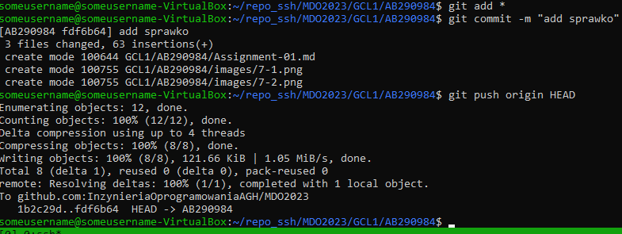
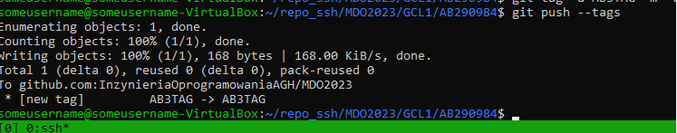
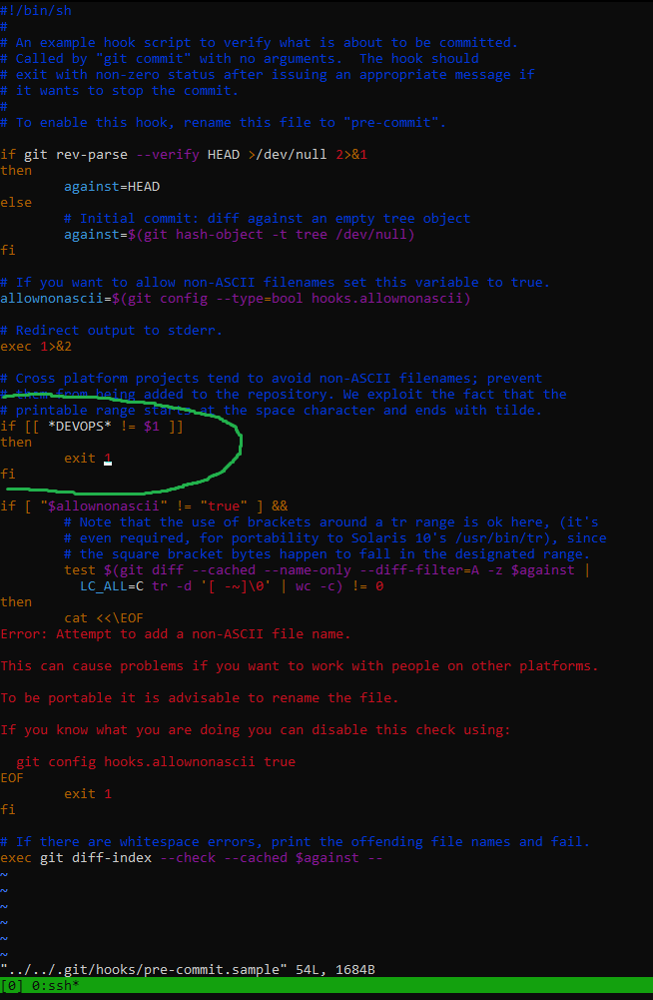
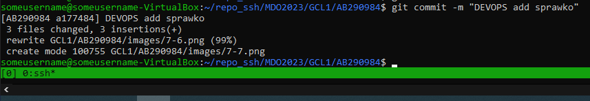

# Zajęcia 01
### 2022-11-26
---
# Wprowadzenie, Git, Gałęzie, SSH
- Wykonaj opisane niżej kroki i dokumentuj ich wykonanie
- Na dokumentację składają się następujące elementy:
  - plik tekstowy ze sprawozdaniem, zawierający opisy z każdego z punktów zadania
  - zrzuty ekranu przedstawiające wykonane kroki
  - listing historii poleceń
- Sprawozdanie z zadania powinno umożliwiać odtworzenie wykonanych kroków w wykorzystaniem opisu, poleceń i zrzutów

## Zadania do wykonania
### Weryfikacja sprawności środowiska UNIX
1. Wykaż możliwość komunikacji ze środowiskiem linuksowym (powłoka oraz przesyłanie plików)

1. Zainstaluj klienta Git i obsługę kluczy SSH

2. Sklonuj repozytorium https://github.com/InzynieriaOprogramowaniaAGH/MDO2023 za pomocą HTTPS

3. Upewnij się w kwestii dostępu do repozytorium jako uczestnik i sklonuj je za pomocą utworzonego klucza SSH
   - Utwórz dwa klucze SSH, inne niż RSA, w tym co najmniej jeden zabezpieczony hasłem


   - Skonfiguruj klucz SSH jako metodę dostępu

   - Sklonuj repozytorium z wykorzystaniem protokołu SSH

4. Przełącz się na gałąź swojej grupy

5. Utwórz gałąź o nazwie "inicjały & nr indeksu" np. ```KD232144```

6. Rozpocznij pracę na nowej gałęzi
   - W katalogu właściwym dla grupy utwórz nowy katalog, także o nazwie "inicjały & nr indeksu" np. ```KD232144```
   - W nowym katalogu dodaj plik ze sprawozdaniem

   - Dodaj zrzuty ekranu

   - Wyślij zmiany do zdalnego źródła
   - Spróbuj wciągnąć swoją gałąź do gałęzi grupowej

   - Zaktualizuj sprawozdanie i zrzuty o ten krok i wyślij aktualizację do zdalnego źródła (na swojej gałęzi)

   - Oznacz tagiem ostatni commit i wypchnij go na zdalną gałąź

   - Ustal hook, który będzie sprawdzał, czy wiadomość z commitem zawiera nazwę przedmiotu



   - W jaki sposób stworzyć hook, który będzie *ustawiał* prefiks wiadomości commitu tak, by miał nazwę przedmiotu?


### Weryfikacja działania środowiska konteneryzacji
1. Rozpocznij przygotowanie środowiska Dockerowego
    * zapewnij dostęp do maszyny wirtualnej przez zdalny terminal (nie "przez okienko")
    * jeżeli nie jest stosowane VM (np. WSL, Mac, natywny linux), wykaż ten fakt **dokładnie**
    * zainstaluj środowisko dockerowe w stosowanym systemie operacyjnym
4. Działanie środowiska
    * wykaż, że środowisko dockerowe jest uruchomione i działa (z definicji)
    * wykaż działanie z sposób praktyczny (z własności):
      * pobierz obraz dystrybucji linuksowej i uruchom go 
      * wyświetl jego numer wersji

5. Załóż konto na Docker Hub lub zaloguj się do już posiadanego. Zadbaj o 2FA.


## Główny wątek następnych zajęć
### Wybór oprogramowania na zajęcia
* Znajdź repozytorium z kodem dowolnego oprogramowania, które:
	* dysponuje otwartą licencją
	* jest umieszczone wraz ze swoimi narzędziami Makefile tak, aby możliwe był uruchomienie w repozytorium czegoś na kształt ```make build``` oraz ```make test```. Środowisko Makefile jest dowolne. Może to być automake, meson, npm, maven, nuget, dotnet, msbuild...
	* Zawiera zdefiniowane i obecne w repozytorium testy, które można uruchomić np. jako jeden z "targetów" Makefile'a. Testy muszą jednoznacznie formułować swój raport końcowy (gdy są obecne, zazwyczaj taka jest praktyka)
* Sklonuj niniejsze repozytorium, przeprowadź build programu (doinstaluj wymagane zależności)
* Uruchom testy jednostkowe dołączone do repozytorium


