# Zajęcia 02
### 2022-11-27
---
## Format sprawozdania
- Wykonaj opisane niżej kroki i dokumentuj ich wykonanie
- Na dokumentację składają się następujące elementy:
  - plik tekstowy ze sprawozdaniem, zawierający opisy z każdego z punktów zadania
  - zrzuty ekranu przedstawiające wykonane kroki (oddzielny zrzut ekranu dla każdego kroku)
  - listing historii poleceń (cmd/bash/PowerShell)
- Sprawozdanie z zadania powinno umożliwiać **odtworzenie wykonanych kroków** z wykorzystaniem opisu, poleceń i zrzutów. Oznacza to, że sprawozdanie powinno zawierać opis czynności w odpowiedzi na (także zawarte) kroki z zadania. Przeczytanie dokumentu powinno umożliwiać zapoznanie się z procesem i jego celem bez konieczności otwierania treści zadania.

- Sprawozdanie proszę umieścić w następującej ścieżce: ```<grupa>/<inicjały><numerIndeksu>/Lab2/Sprawozdanie.md```, w formacie Markdown
## Wprowadzenie do kontenerów
- Wykonaj opisane niżej kroki i dokumentuj ich wykonanie
- Na dokumentację składają się następujące elementy:
  - plik tekstowy ze sprawozdaniem, zawierający opisy z każdego z punktów zadania
  - zrzuty ekranu przedstawiające wykonane kroki
  - listing historii poleceń
- Sprawozdanie z zadania powinno umożliwiać odtworzenie wykonanych kroków w wykorzystaniem opisu, poleceń i zrzutów

## Zestawienie środowiska
1. Zainstaluj Docker w systemie linuksowym

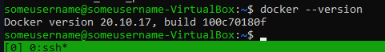
2. Zarejestruj się w Docker Hub i zapoznaj z sugerowanymi obrazami
3. Pobierz hello-world, busybox, ubuntu lub fedorę, mysql
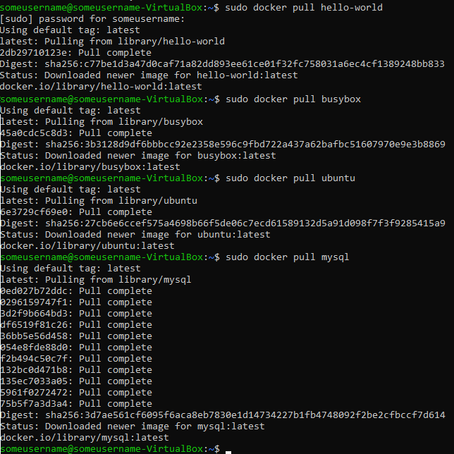
4. Uruchom busybox
   - Pokaż efekt uruchomienia kontenera
   - Podłącz się do kontenera interaktywnie i wywołaj numer wersji
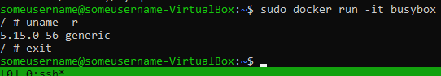
5. Uruchom "system w kontenerze"
   - Zaprezentuj PID1 w kontenerze i procesy dockera na hoście
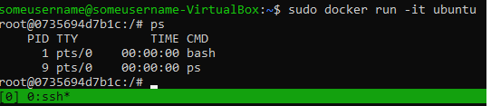
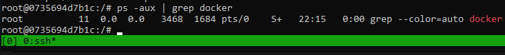
   - Zaktualizuj pakiety
   - Wyjdź
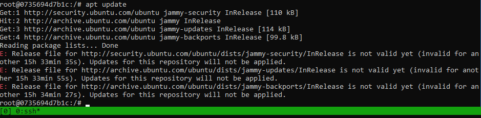
6. Pokaż uruchomione ( != "działające" ) kontenery, wyczyść je.
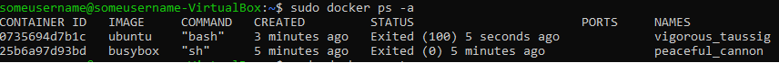
7. Wyczyść obrazy
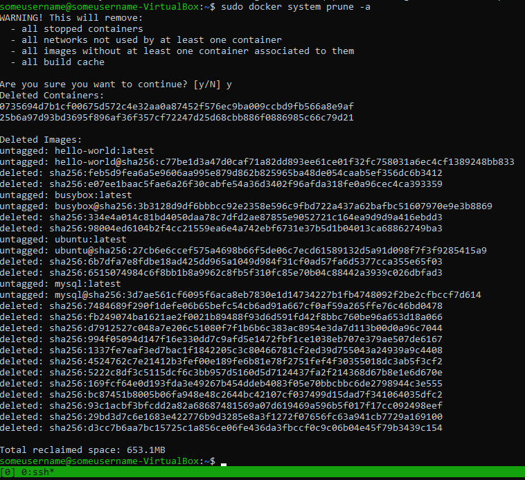

## Budowanie programu
1. Znajdź projekt umożliwiający łatwe wywołanie testów jednostkowych
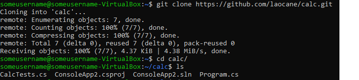
2. Przeprowadź budowę/konfigurację środowiska
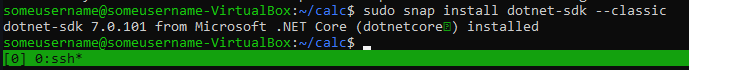
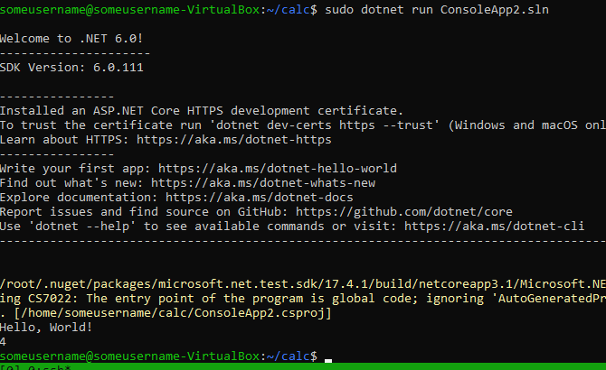
3. Uruchom testy
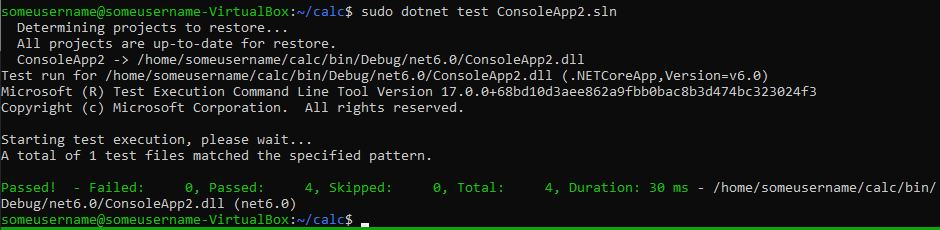
4. Ponów ten proces w kontenerze
   - Wybierz i uruchom platformę
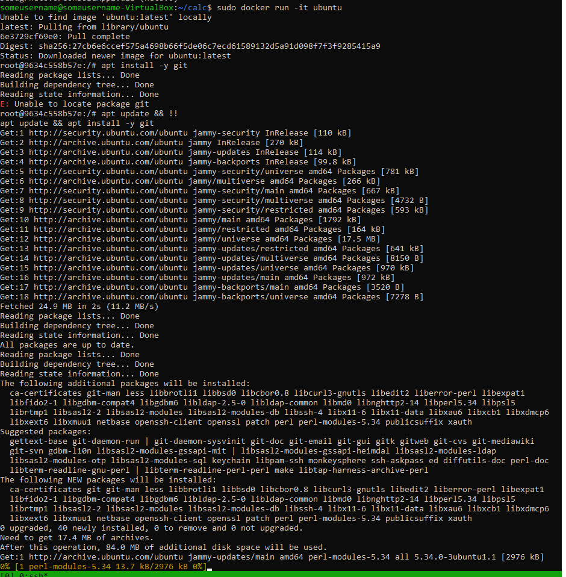
   - Zaopatrz ją w odpowiednie oprogramowanie wstępne
   - Sklonuj aplikację
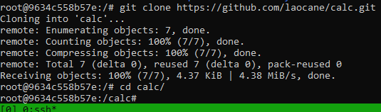
   - Skonfiguruj środowisko i uruchom build
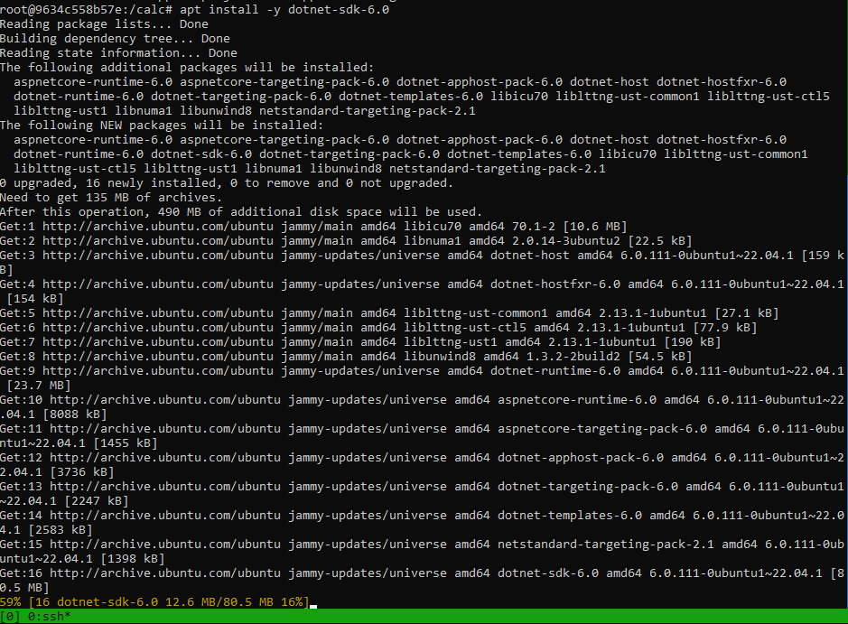
   - Uruchom testy
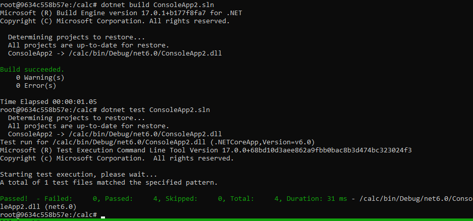
5. Stwórz Dockerfile, który ma to osiągnąć
   - Na bazie platformowego obrazu...
   - ...doinstaluj wymagania wstępne...
   - ...sklonuj repozytorium...
   - ...zbuduj kod

6. Zaprezentuj Dockerfile i jego zbudowanie
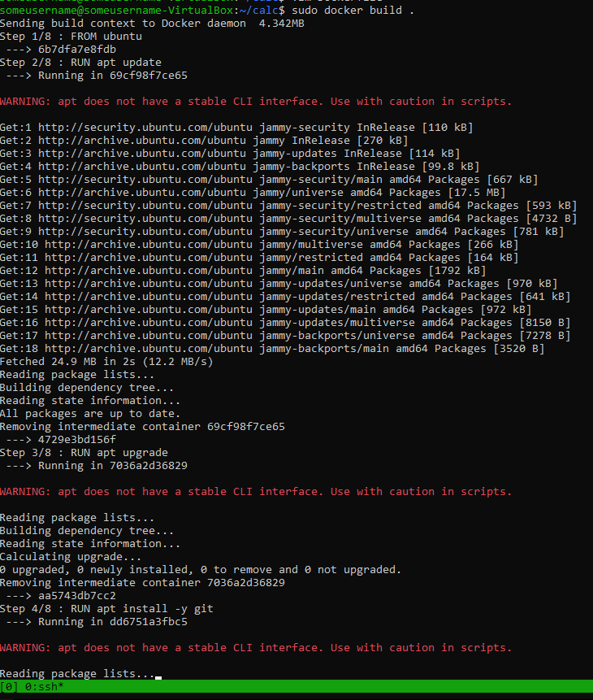
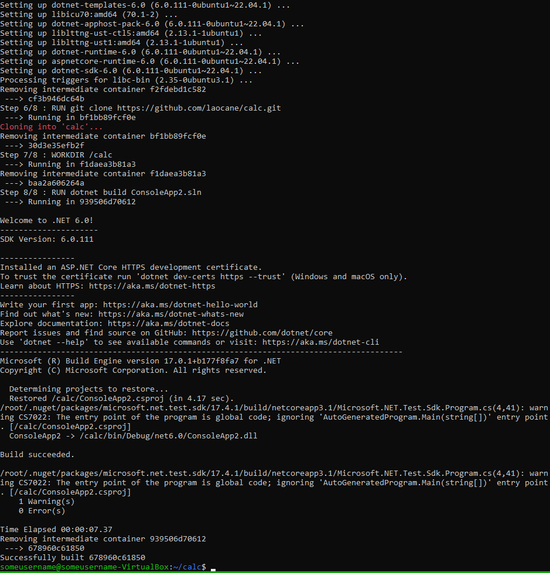
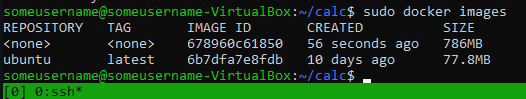
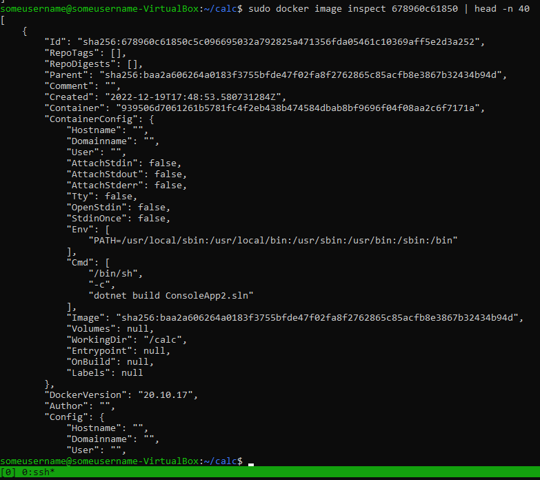
7. Na bazie obrazu utworzonego poprzednim dockerfilem stwórz kolejny, który będzie uruchamiał testy
 	* Kontener pierwszy ma przeprowadzać wszystkie kroki aż do builda
	* Kontener drugi ma bazować na pierwszym i wykonywać testy
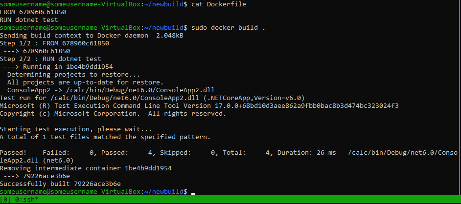

## Runda bonusowa: kompozycja
1. Zdefiniuj kompozycję, która stworzy dwie usługi
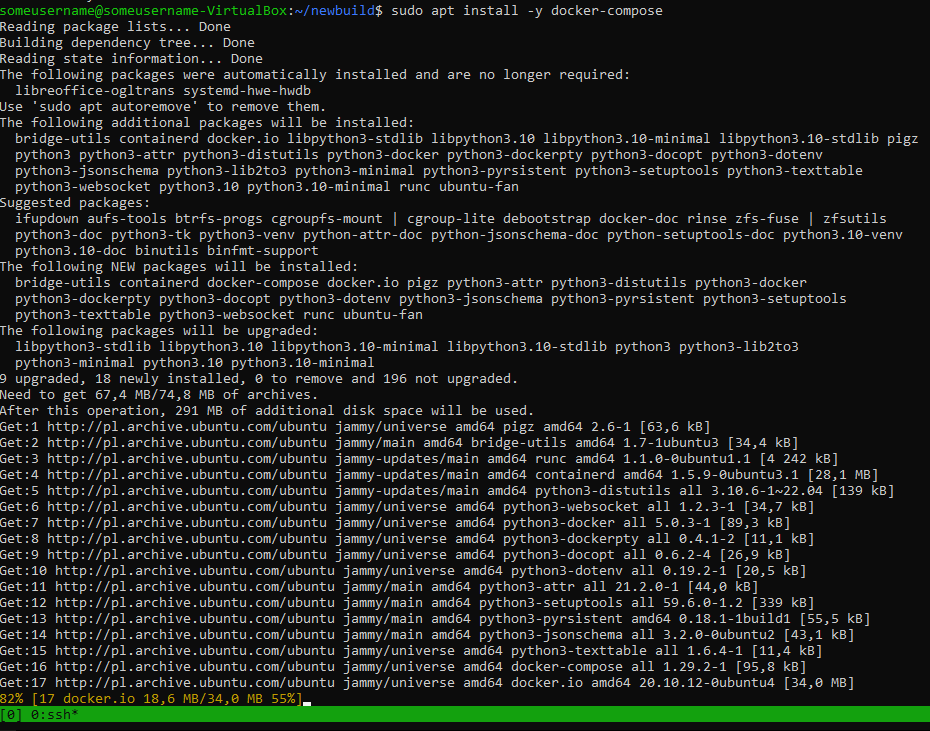
   - Pierwszą na bazie dockerfile'a budującego
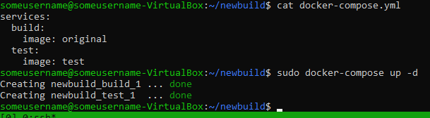
   - Drugą na bazie pierwszej
2. Wdróż :)

## Przygotowanie do wdrożenia (deploy): dyskusje
Otrzymany kontener ze zbudowanym programem może, ale nie musi, być już końcowym artefaktem procesu przygotowania nowego wydania. Jednakże, istnieje szereg okoliczności, w których nie ma to sensu. Na przykład gdy chodzi o oprogramowanie interaktywne, które kiepsko działa w kontenerze.

Przeprowadź dyskusję i wykaż:
* czy program nadaje się do wdrażania i publikowania jako kontener, czy taki sposób interakcji nadaje się tylko do builda
* opisz w jaki sposób miałoby zachodzić przygotowanie finalnego artefaktu
	* jeżeli program miałby być publikowany jako kontener - czy trzeba go oczyszczać z pozostałości po buildzie?
	* A może dedykowany *deploy-and-publish* byłby oddzielną ścieżką (inne Dockerfiles)?
	* Czy zbudowany program należałoby dystrybuować jako pakiet, np. JAR, DEB, RPM, EGG?
	* W jaki sposób zapewnić taki format? Dodatkowy krok (trzeci kontener)? Jakiś przykład?
   

