# Sprawozdanie 02
### 2022-12-17

1.Instalacja docker w systemie linuxowym
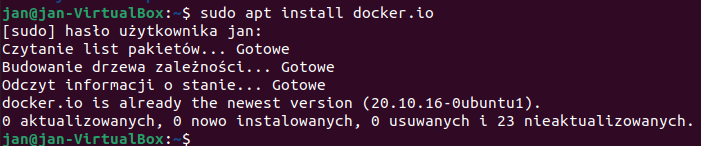
2.Pobranie busybox, hello-world,ubuntu lub fedore, mysql 

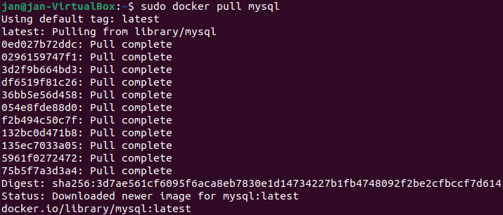
3.Uruchomienie busybox i nr wersji
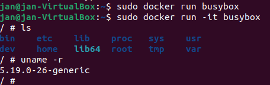
4.Uruchomienie systemu w kontenerze
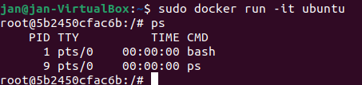
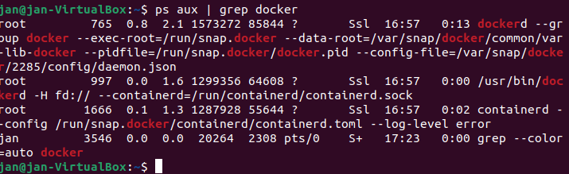
5.Pokazanie oraz czyszczenie obrazow
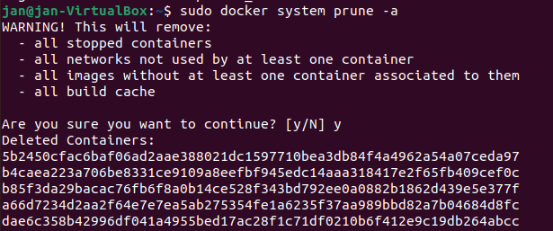

6.Klon programu(ava)

7.Uruchomienie programu
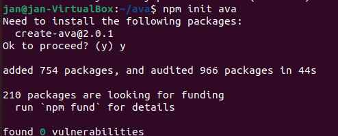
8.Przeprowadzenie testow
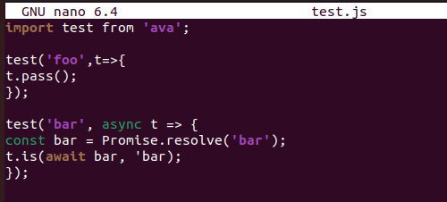
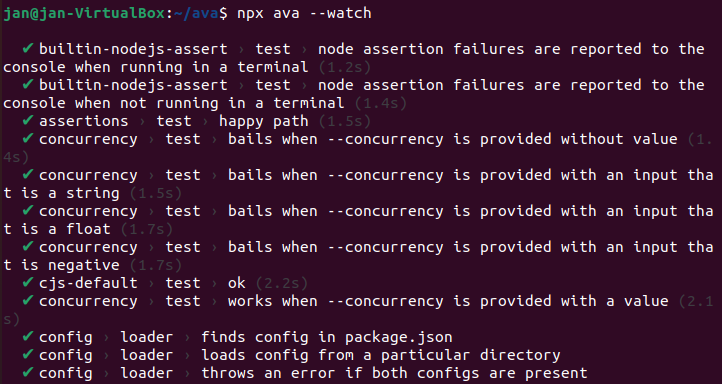
9.Uruchomienie programu w kontenerze
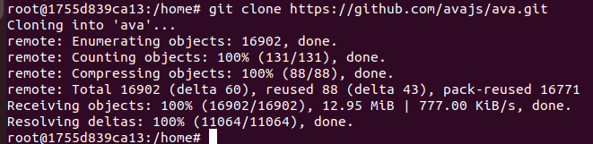
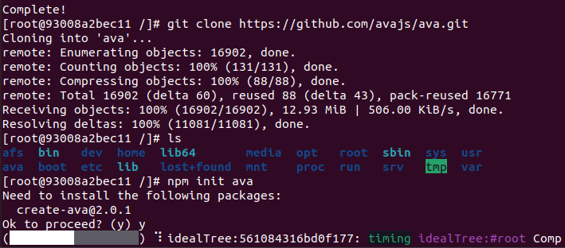
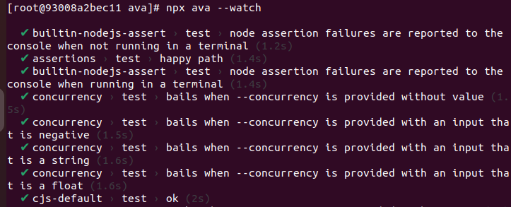
10.Tworzenie Dockerfile bez testow
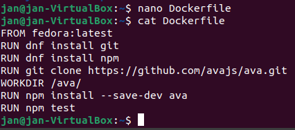
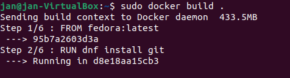
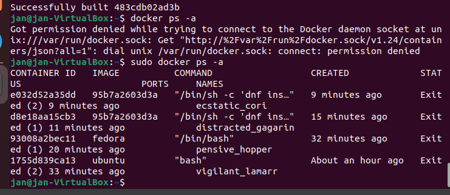
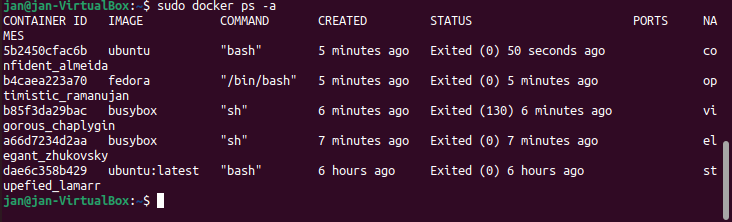
11.Tworzenie Dockerfile z testami
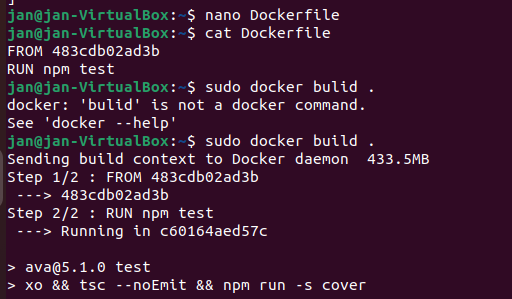

