#Sprawozdanie 01 - Wprowadzenie, Git, Gałęzie, SSH 
#08-12
---
Uruchomienie i aktywacja serwera SSH
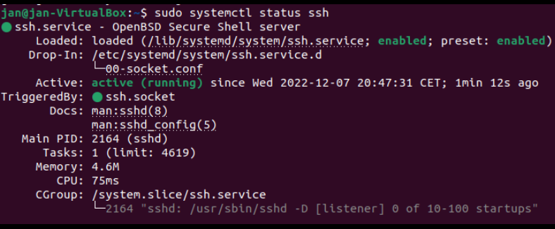
Próba logowania z hosta na maszynę.
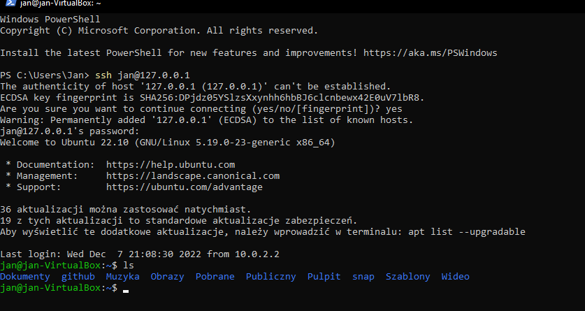
Próba logowania z hosta na maszyne za pomoca SFTP.
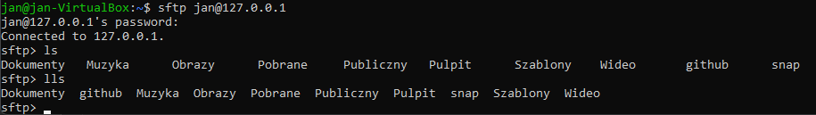
Pobranie pliku z maszyny na hosta.
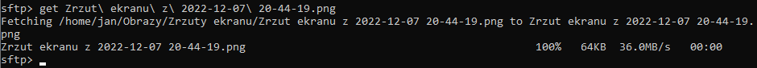
Wysłanie pliku z hosta na maszyne.
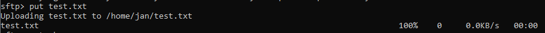
Instalacja gita.

Klonowanie repozytorium za pomocą protokołu HTTPS.
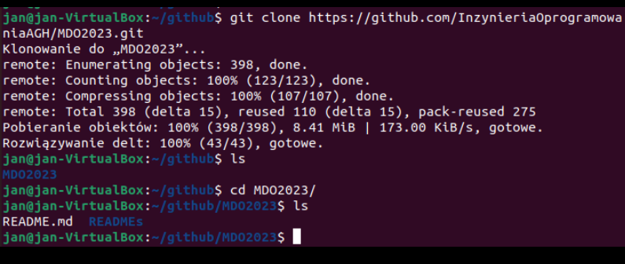
Generowania klucza bez hasła

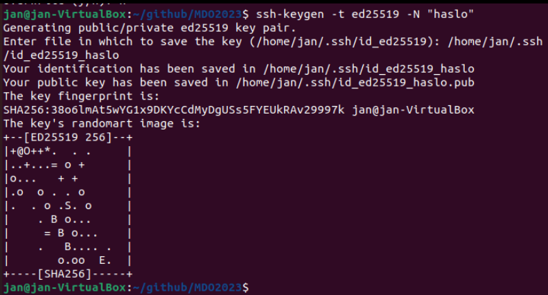

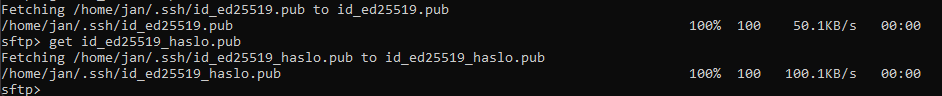

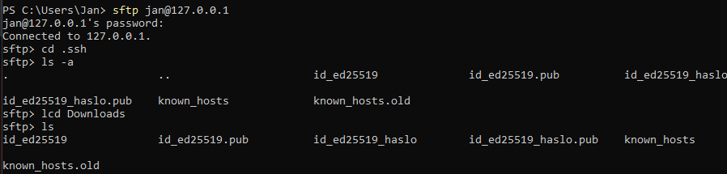

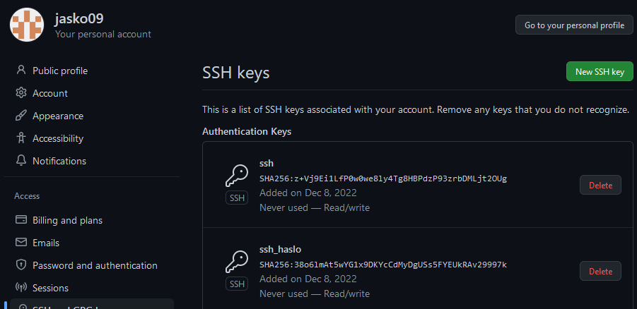

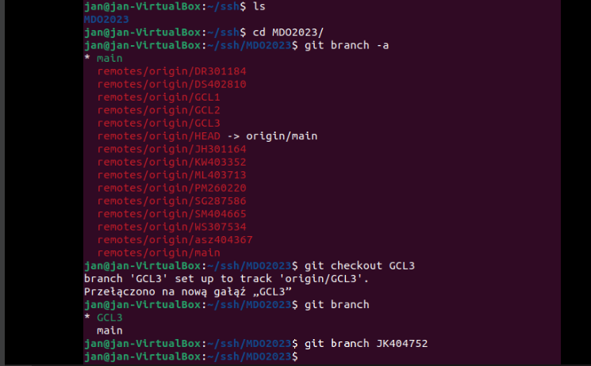

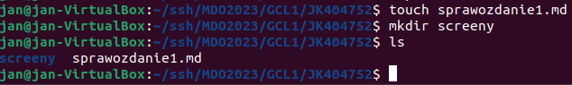

