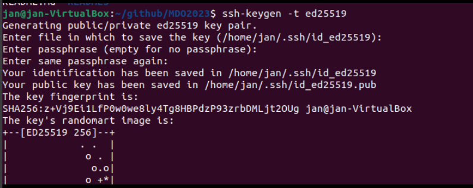
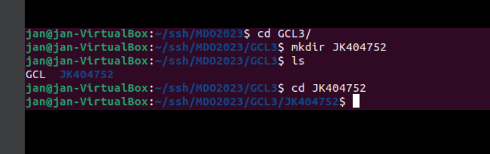
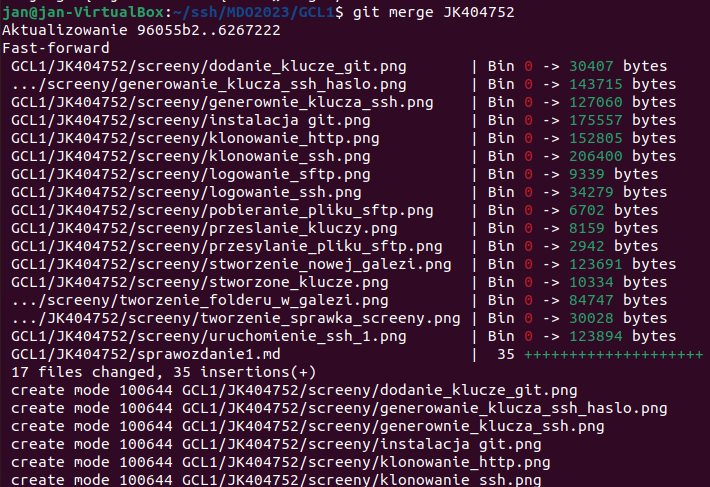
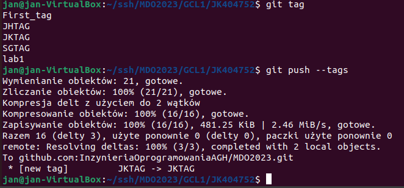
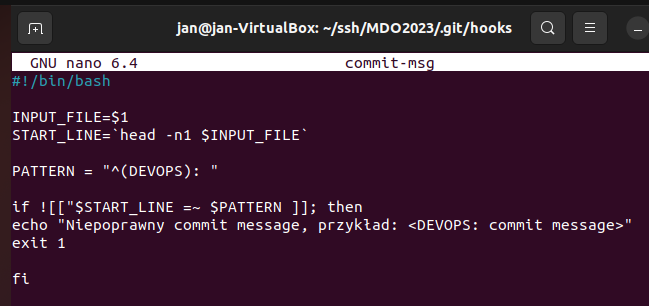
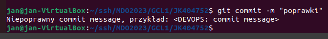

#Sprawozdanie 01 - Wprowadzenie, Git, Gałęzie, SSH 
#08-12
---
1.Uruchomienie i aktywacja ssh

2.Logowanie za pomocą protokołu ssh

3.Logowanie za pomocą sftp

4.Pobieranie pliku z maszyny na hosta

5.Pobieranie pliku z hosta na maszyne

6.Instalacja git

7.Klonowanie repozytorium za pomocą protokolu https

8.Generowanie klucza ssh bez hasla

9.Generowanie klucza ssh z haslem

10.Przeslanie kluczy z maszyny na hosta

11.Oba klucze

12.Dodanie kluczy na github

13.Klonowanie repozytorium za pomocą protokołu ssh

14.Stworzenie nowej galezi

15.Tworzenie folderów w gałezi

16.Stworzenie sprawozdania i folderu na ss

17.Wciaganie swojej galezi do gałezi grupowej

18.Oznaczenie tagiem ostatni commit

19.Ustalanie nowego hooka

20.Test działania hooka

