# Zajęcia 01
### 2022-11-26
---
# Wprowadzenie, Git, Gałęzie, SSH
- Wykonaj opisane niżej kroki i dokumentuj ich wykonanie
- Na dokumentację składają się następujące elementy:
  - plik tekstowy ze sprawozdaniem, zawierający opisy z każdego z punktów zadania
  - zrzuty ekranu przedstawiające wykonane kroki
  - listing historii poleceń
- Sprawozdanie z zadania powinno umożliwiać odtworzenie wykonanych kroków w wykorzystaniem opisu, poleceń i zrzutów

## Zadania do wykonania
### Weryfikacja sprawności środowiska UNIX
1. Wykaż możliwość komunikacji ze środowiskiem linuksowym (powłoka oraz przesyłanie plików)
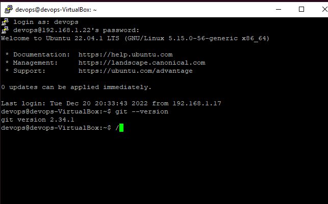
2. Zainstaluj klienta Git i obsługę kluczy SSH

3. Sklonuj repozytorium https://github.com/InzynieriaOprogramowaniaAGH/MDO2023 za pomocą HTTPS
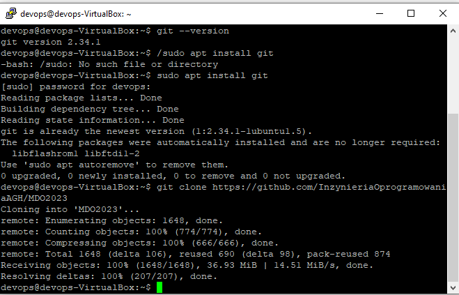
4. Upewnij się w kwestii dostępu do repozytorium jako uczestnik i sklonuj je za pomocą utworzonego klucza SSH
   - Utwórz dwa klucze SSH, inne niż RSA, w tym co najmniej jeden zabezpieczony hasłem
   - Skonfiguruj klucz SSH jako metodę dostępu
   - Sklonuj repozytorium z wykorzystaniem protokołu SSH
   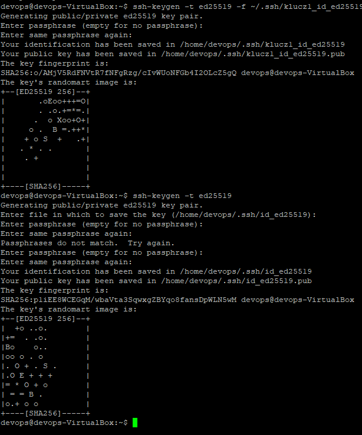
   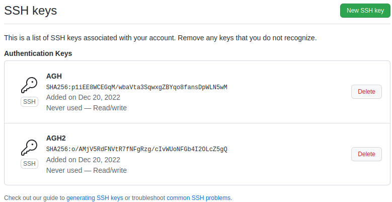
   
5. Przełącz się na gałąź swojej grupy
6. Utwórz gałąź o nazwie "inicjały & nr indeksu" np. ```KD232144```
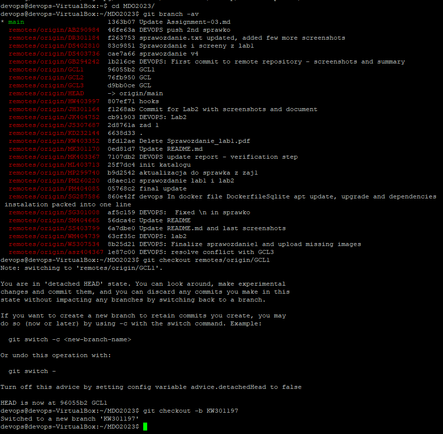
7. Rozpocznij pracę na nowej gałęzi
   - W katalogu właściwym dla grupy utwórz nowy katalog, także o nazwie "inicjały & nr indeksu" np. ```KD232144```
   - W nowym katalogu dodaj plik ze sprawozdaniem
   - Dodaj zrzuty ekranu
   - Wyślij zmiany do zdalnego źródła
   - Spróbuj wciągnąć swoją gałąź do gałęzi grupowej
   - Zaktualizuj sprawozdanie i zrzuty o ten krok i wyślij aktualizację do zdalnego źródła (na swojej gałęzi)
   - Oznacz tagiem ostatni commit i wypchnij go na zdalną gałąź
   - Ustal hook, który będzie sprawdzał, czy wiadomość z commitem zawiera nazwę przedmiotu
   - W jaki sposób stworzyć hook, który będzie *ustawiał* prefiks wiadomości commitu tak, by miał nazwę przedmiotu?
   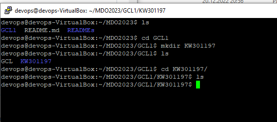
   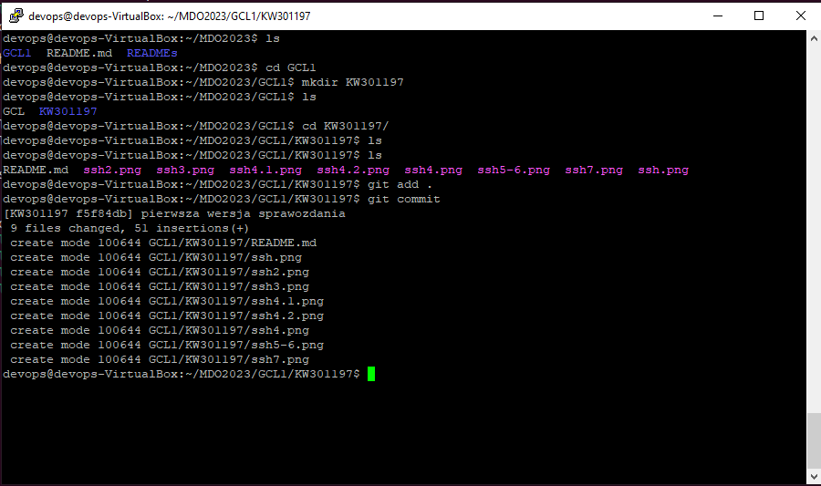
   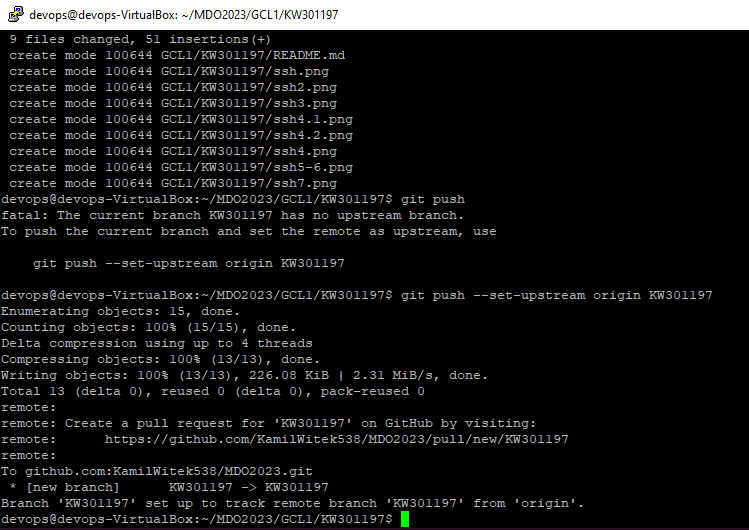
   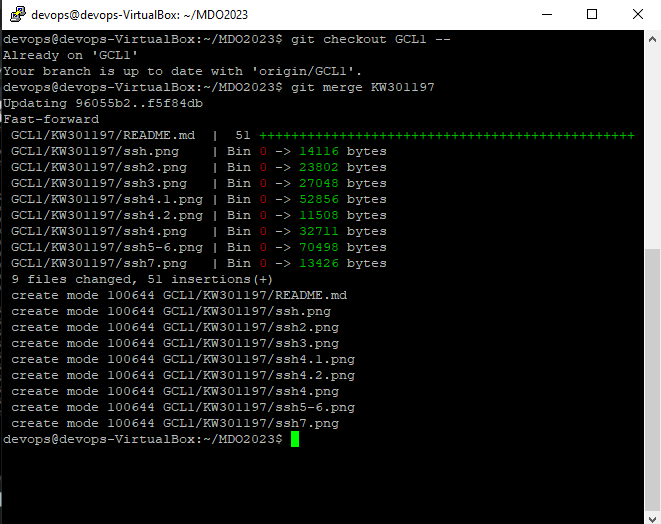
   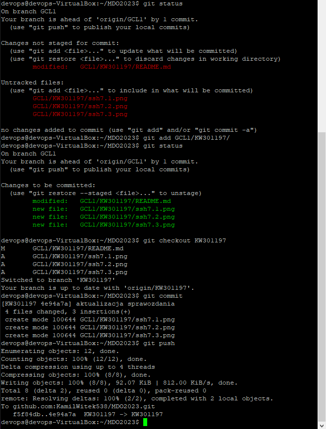
   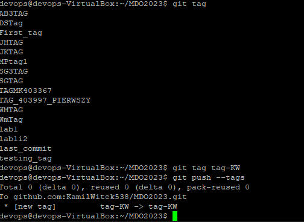
   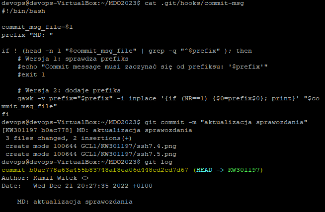
   
### Weryfikacja działania środowiska konteneryzacji
1. Rozpocznij przygotowanie środowiska Dockerowego
    * zapewnij dostęp do maszyny wirtualnej przez zdalny terminal (nie "przez okienko")
    * jeżeli nie jest stosowane VM (np. WSL, Mac, natywny linux), wykaż ten fakt **dokładnie**
    * zainstaluj środowisko dockerowe w stosowanym systemie operacyjnym
    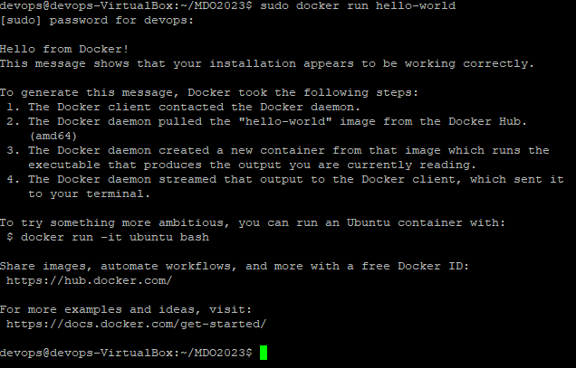
2. Działanie środowiska
    * wykaż, że środowisko dockerowe jest uruchomione i działa (z definicji)
    * wykaż działanie z sposób praktyczny (z własności):
      * pobierz obraz dystrybucji linuksowej i uruchom go 
      * wyświetl jego numer wersji
      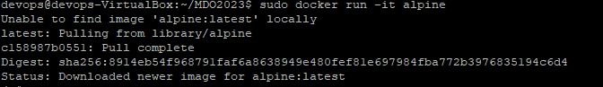
      
      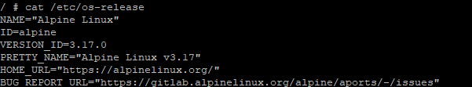
3. Załóż konto na Docker Hub lub zaloguj się do już posiadanego. Zadbaj o 2FA.
