# Zajęcia 02
### 2022-11-27
---

## Zestawienie środowiska
1. Zainstaluj Docker w systemie linuksowym

Docker Engine zainstalowany na hoście (Ubuntu w VM) zgodnie z instrukcją z oficjalnej dokumentacji:
https://docs.docker.com/engine/install/ubuntu/

Wykonane komendy:
```
# Upewniamy się że nie jest zainstalowana nieaktualna wersja z repozytorium Ubuntu - będziemy korzystać z repozytorium deb dostarczonego przez upstream Dockera
sudo apt-get remove docker docker-engine docker.io containerd runc

# Przygotowanie pod dodanie repozytorium deb
sudo apt-get update
sudo apt-get install \
    ca-certificates \
    curl \
    gnupg \
    lsb-release

# Dodajemy klucz upstreamu Dockera, którym podpisane są paczki
sudo mkdir -p /etc/apt/keyrings
curl -fsSL https://download.docker.com/linux/ubuntu/gpg | sudo gpg --dearmor -o /etc/apt/keyrings/docker.gpg

# Dodajemy repozytorium deb upstreamu Dockera
echo \
  "deb [arch=$(dpkg --print-architecture) signed-by=/etc/apt/keyrings/docker.gpg] https://download.docker.com/linux/ubuntu \
  $(lsb_release -cs) stable" | sudo tee /etc/apt/sources.list.d/docker.list > /dev/null

# Aktualizujemy stan apt po dodaniu nowego repozytorium
sudo apt-get update

# Instalujemy aktualną wersję Dockera z repozytorium upstreamu
sudo apt-get install docker-ce docker-ce-cli containerd.io docker-compose-plugin
``` 

2. Zarejestruj się w Docker Hub i zapoznaj z sugerowanymi obrazami
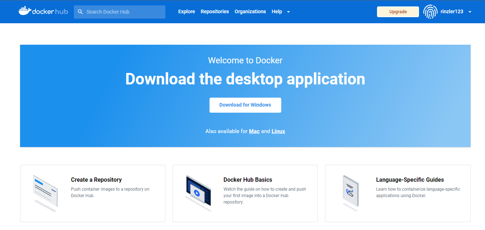
3. Pobierz hello-world, busybox, ubuntu lub fedorę, mysql
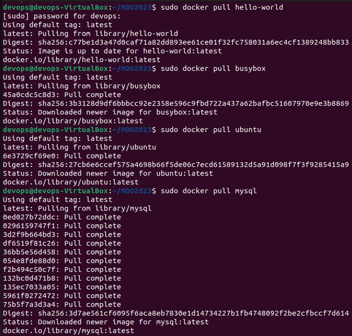
4. Uruchom busybox
   - Pokaż efekt uruchomienia kontenera
   - Podłącz się do kontenera interaktywnie i wywołaj numer wersji
   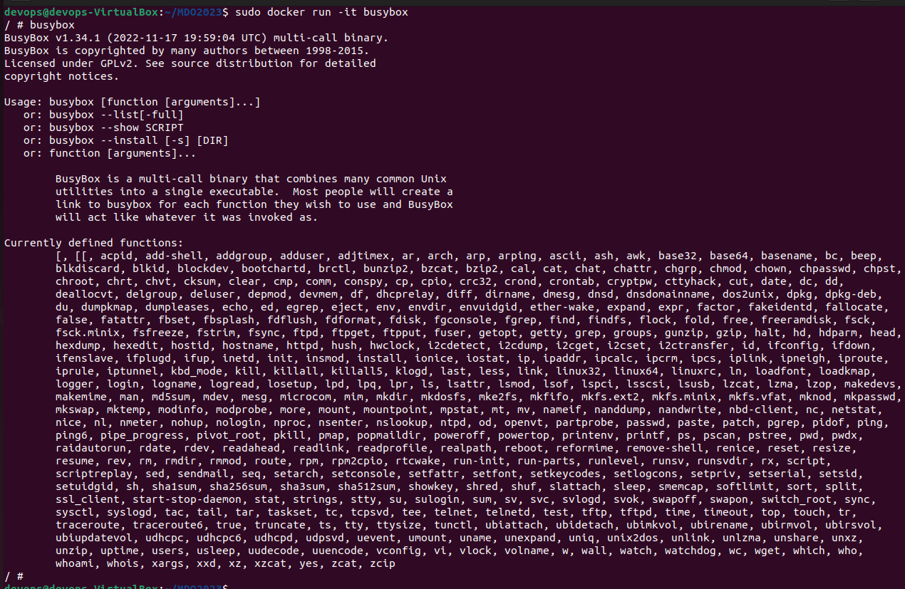
5. Uruchom "system w kontenerze"
   - Zaprezentuj PID1 w kontenerze i procesy dockera na hoście
   - Zaktualizuj pakiety
   - Wyjdź
   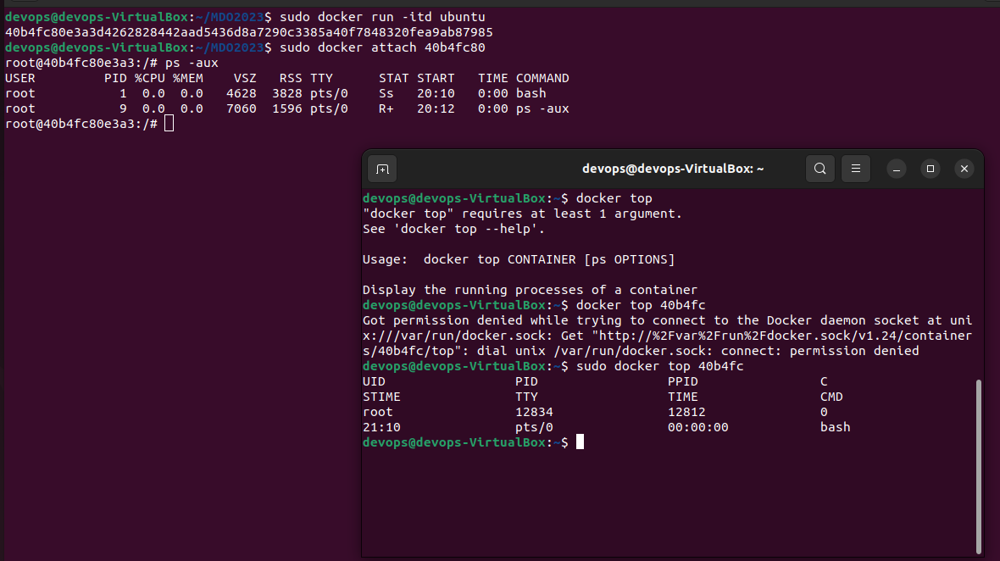
   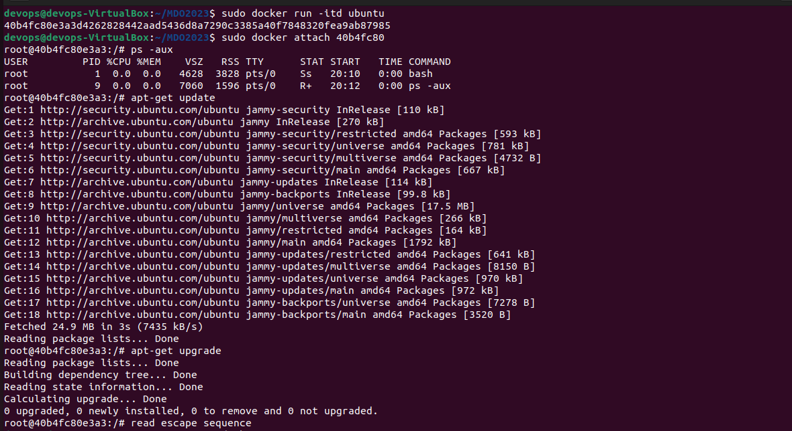
6. Pokaż uruchomione ( != "działające" ) kontenery, wyczyść je.
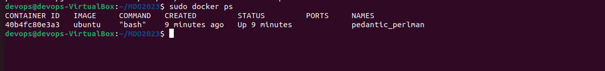
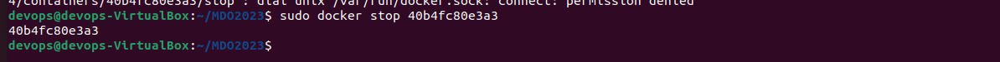
7. Wyczyść obrazy
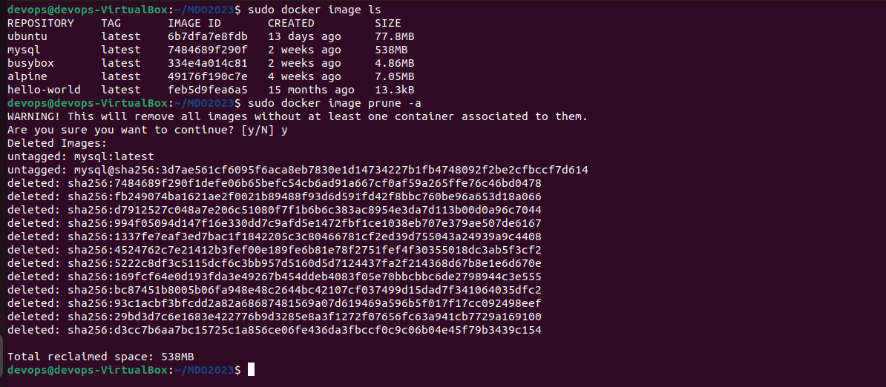

## Budowanie programu
1. Znajdź projekt umożliwiający łatwe wywołanie testów jednostkowych
https://github.com/derf/feh
feh to prosta przeglądarka plików graficznych. Projekt posiada ręcznie napisany Makefile (bez użycia systemów w rodzaju Autotools lub CMake) co upraszcza budowanie i testowanie apliokacji na potrzeby ćwiczenia

2. Przeprowadź budowę/konfigurację środowiska
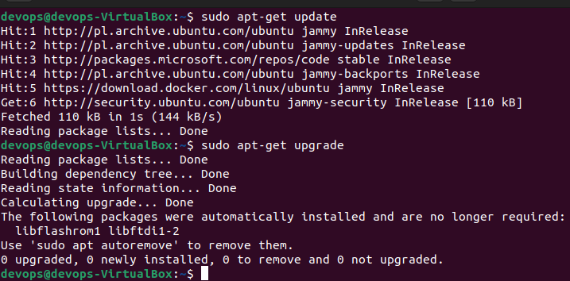
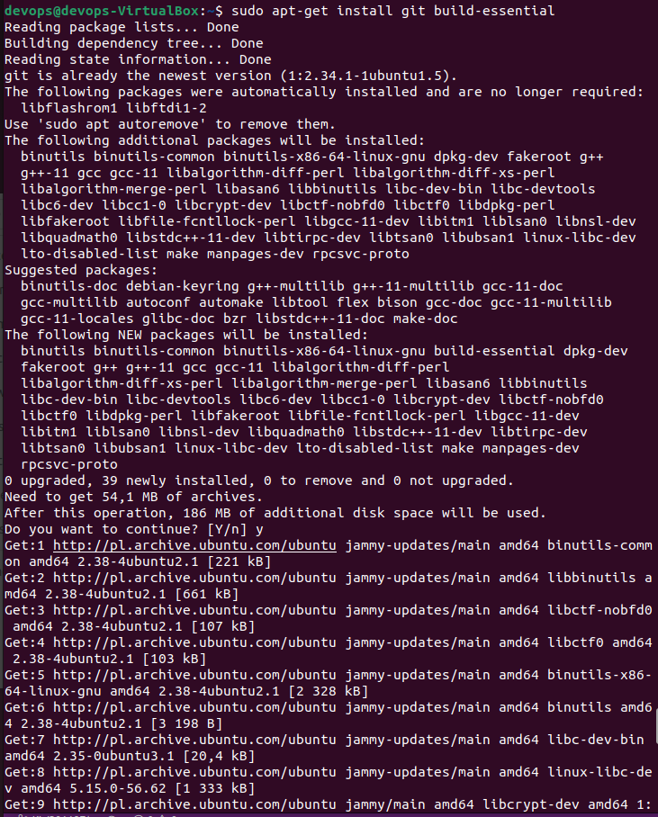
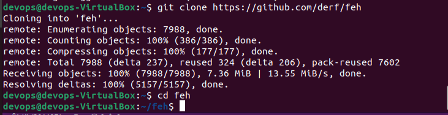
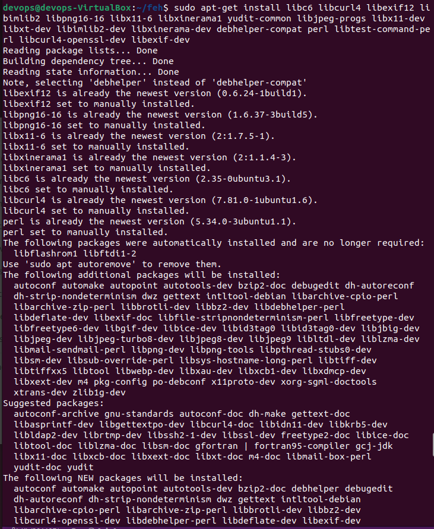
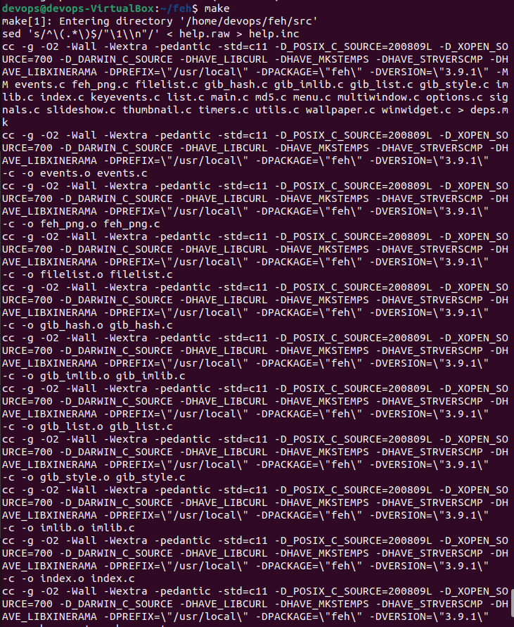
3. Uruchom testy
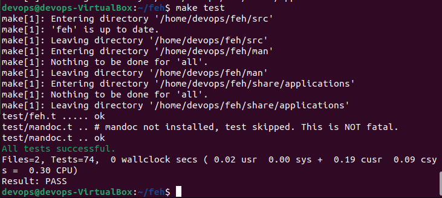
4. Ponów ten proces w kontenerze
   - Wybierz i uruchom platformę
   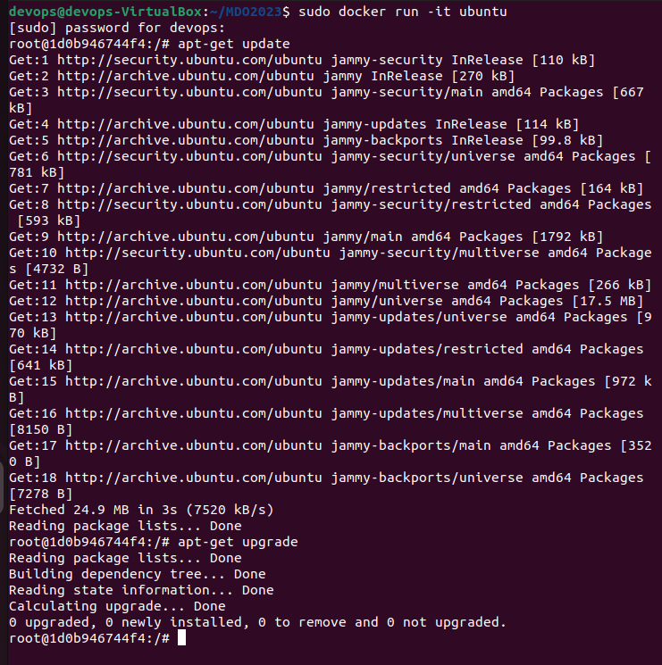
   - Zaopatrz ją w odpowiednie oprogramowanie wstępne
   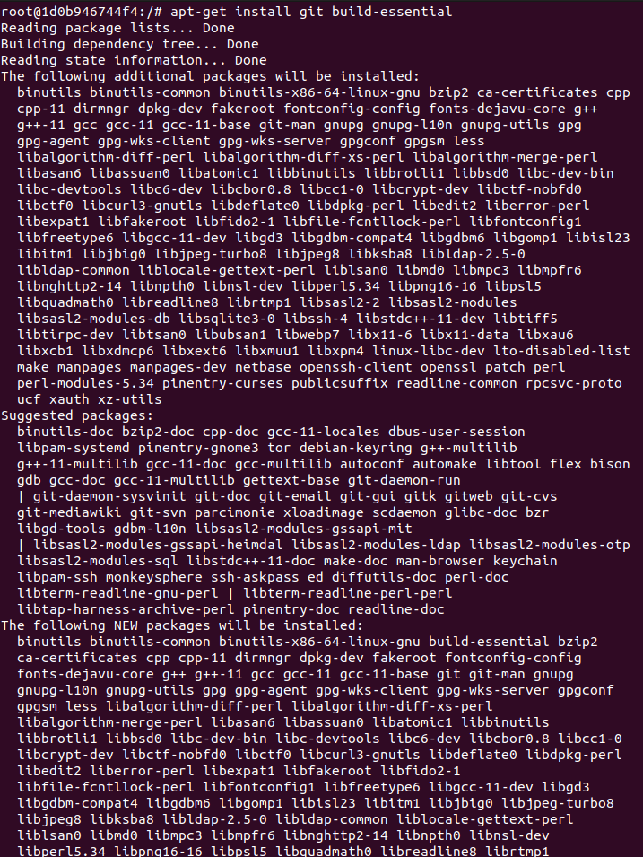
   - Sklonuj aplikację
   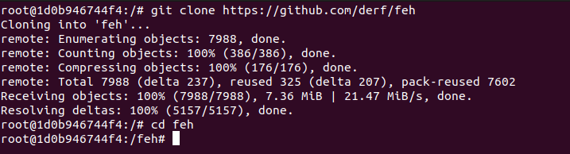
   - Skonfiguruj środowisko i uruchom build
   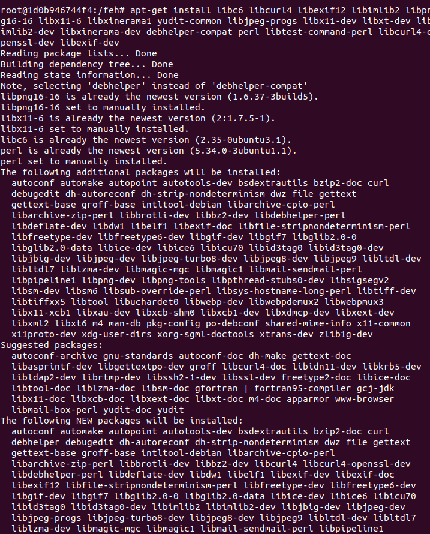
   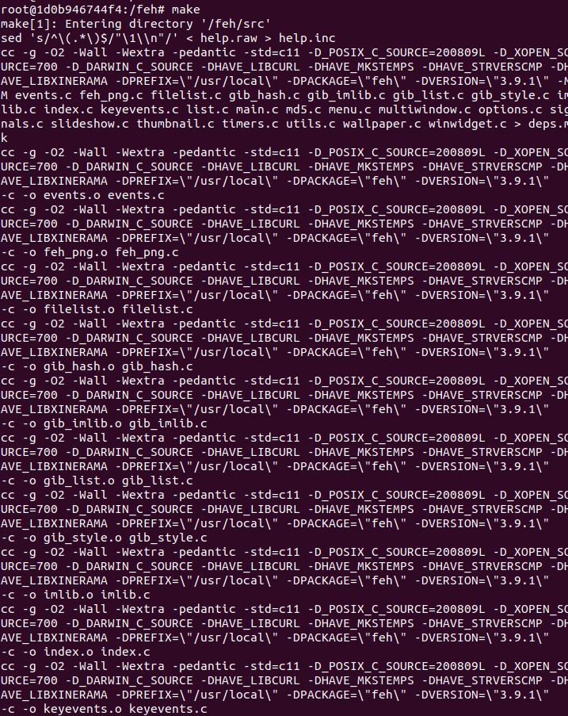
   - Uruchom testy
   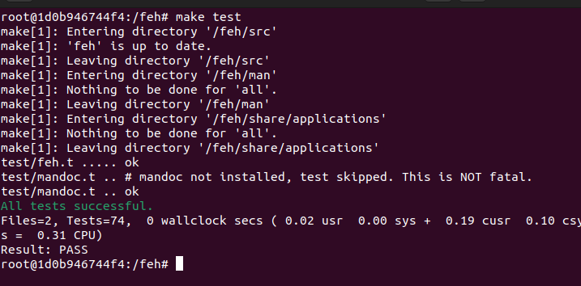

5. Stwórz Dockerfile, który ma to osiągnąć
   - Na bazie platformowego obrazu...
   - ...doinstaluj wymagania wstępne...
   - ...sklonuj repozytorium...
   - ...zbuduj kod
6. Zaprezentuj Dockerfile i jego zbudowanie
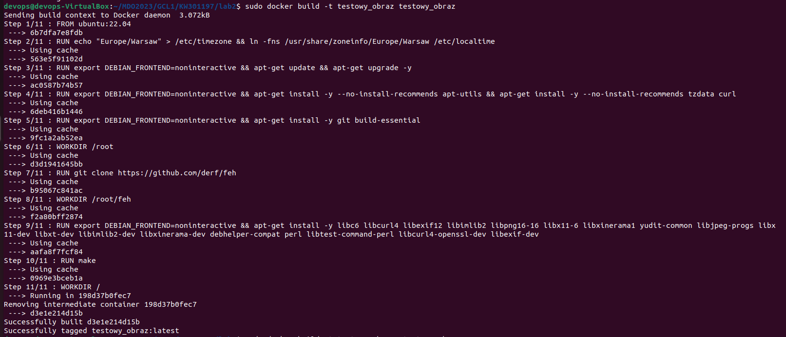
7. Na bazie obrazu utworzonego poprzednim dockerfilem stwórz kolejny, który będzie uruchamiał testy
 	* Kontener pierwszy ma przeprowadzać wszystkie kroki aż do builda
	* Kontener drugi ma bazować na pierwszym i wykonywać testy
    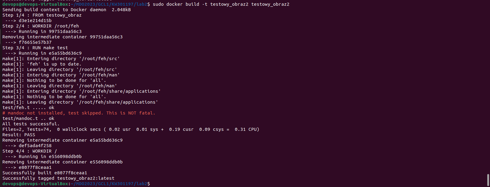