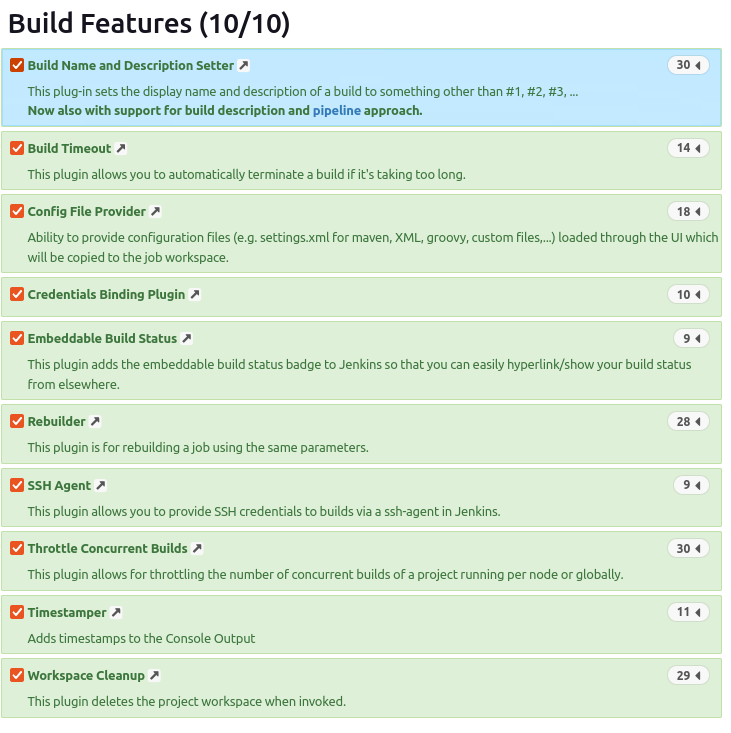
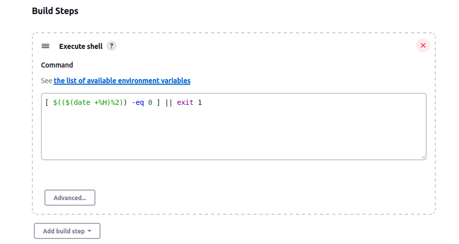

## Pipeline, Jenkins, izolacja etapów

### Przygotowanie
* Upewnij się, że na pewno działają kontenery budujące i testujące, stworzone na poprzednich zajęciach
* Zapoznaj się z instrukcją instalacji Jenkinsa: https://www.jenkins.io/doc/book/installing/docker/
  * Uruchom obraz Dockera który eksponuje środowisko zagnieżdżone
    
  * Przygotuj obraz blueocean na podstawie obrazu Jenkinsa (czym się różnią?)
    Obraz stworzony wg poniższego Dockerfile uzupełnia środowisko Jenkinsa o pluginy Blueocean i Docker
    ```
    FROM jenkins/jenkins:2.375.2
    USER root
    RUN apt-get update && apt-get install -y lsb-release
    RUN curl -fsSLo /usr/share/keyrings/docker-archive-keyring.asc \
    https://download.docker.com/linux/debian/gpg
    RUN echo "deb [arch=$(dpkg --print-architecture) \
    signed-by=/usr/share/keyrings/docker-archive-keyring.asc] \
    https://download.docker.com/linux/debian \
    $(lsb_release -cs) stable" > /etc/apt/sources.list.d/docker.list
    RUN apt-get update && apt-get install -y docker-ce-cli
    USER jenkins
    RUN jenkins-plugin-cli --plugins "blueocean docker-workflow"
    ``` Workflow
    \
    
  * Uruchom Blueocean
    \
    \
    
  * Zaloguj się i skonfiguruj Jenkins
    \
     \
    Do instalacji dodane zostały pluginy dashboard view i configuration as code.\
    \
    
  * Zadbaj o archiwizację i zabezpieczenie logów
  
### Uruchomienie 
* Konfiguracja wstępna i pierwsze uruchomienie
  * Utwórz projekt, który wyświetla uname
    \
    \
    \
    \
    
  * Utwórz projekt, który zwraca błąd, gdy... godzina jest nieparzysta
    \
    \
    
* Utwórz "prawdziwy" projekt, który:
  * klonuje nasze repozytorium
  * przechodzi na osobistą gałąź
  * buduje obrazy z dockerfiles i/lub komponuje via docker-compose
  
### Pipeline
* Definiuj pipeline korzystający z kontenerów celem realizacji kroków `build -> test`
* Może, ale nie musi, budować się na dedykowanym DIND, ale może się to dziać od razu na kontenerze CI. Należy udokumentować funkcjonalną różnicę między niniejszymi podejściami
* Docelowo, Jenkinsfile definiujący pipeline powinien być umieszczony w repozytorium. Optymalnie: w sforkowanym repozytorium wybranego oprogramowania
\
\
\

