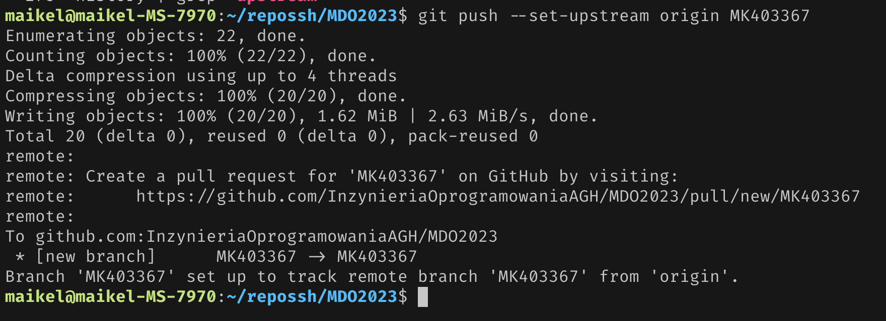
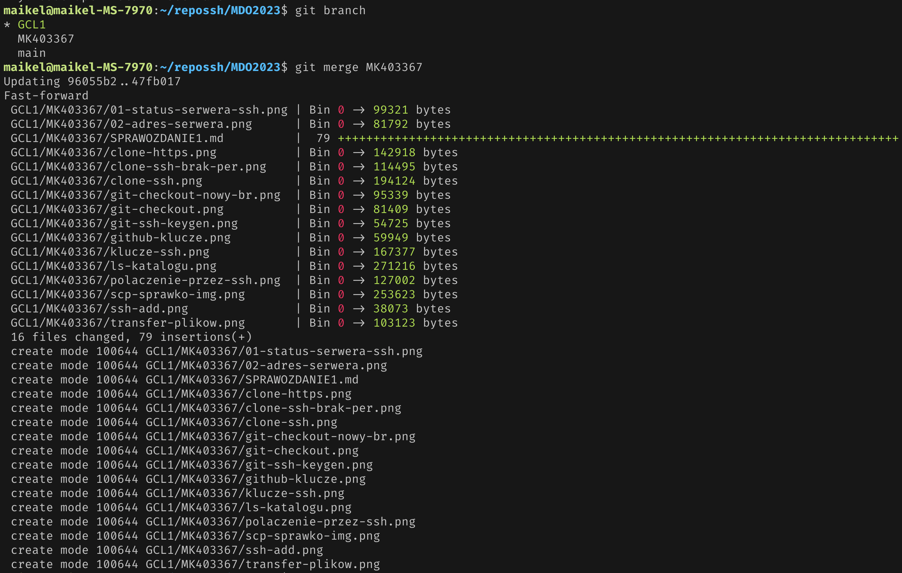

# Sprawozdanie 1
Michał Kutaj
403367

Wykorzystany został natywny system Ubuntu 22, do którego łączę się z sieci lokalnej z macbooka zwanego dalej - "jabuszkiem"


1. Instalacja serwera ssh na serwerze oraz konfiguracja zapory
```
sudo apt update
sudo apt install ssh-server
sudo afw allow ssh
sudo systemctl status ssh
```


Serwerowi został przdzielony adres w sieci lokalnej, mozna go zweryfikować przy pomocy polecenia:
```
ip a
```


Test połączenia z komputera znajdującego się w sieci lokalnej


Test przesyłania plików. Na serwerze w katalogu domowym znajduje się plik `test.txt` zostanie on pobrany przy pomocy komendy:
```
scp maikel@10.0.1.240:~/test.txt ./test.txt
```


2. Polecenia `git` oraz `ssh-keygen` są dostępne w systemie


Repo przedmiotu zostało sklonowane przez https
```
git clone https://github.com/InzynieriaOprogramowaniaAGH/MDO2023
```


Zostały utworzone dwa klucze ssh, wykorzystano algortym `ecdsa`
```
ssh-keygen -t ecdsa
```


Przy próbie pobrania repozytorium przedmiotu przez ssh widać brak uprawnień


Dodano klucz do agenta oraz do konta GitHub
```
ssh-add ~/.ssh/devops_no_pass
```


Teraz mozna pobrać repo przez SSH przy uyciu polecenia
```
git clone git@github.com:InzynieriaOprogramowaniaAGH/MDO2023
```


Przełączenie się na branch grupy
```
git checkout -b GCL1
```


Utworzenie nowego brancha z brancha grupowego
```
git checkout -b MK403367 GCL1
```


Utworzenie katalogu w katalogu grupy i dodanie plików sprawozdania i zrzutów ekranu. Dla wygody edycji sprawozdanie było przygotowane na jabuszku więc pliki zostały przesłane na serwer przed `scp`

Widok katalogu na serwerze po przesłaniu plików

Pliki zostały dodane do repoyztorium, został utworzony commit, który został wypchany na serwer
```
git add *
git commit -m "add report with imgs"
git push --set-upstream origin MK403367
```

Aby zmergować branch nalezy przełączyć się na branch, do którego chcemy dograć zmiany. Merge ma być do brancha grupowego więc na ten branch się przełączamy.
```
git checkout GCL1
bit merge MK403367
```


Aby stworzyć tag nalezy uzyc polecenia
```
git tag TAGMK403367
git push --tags
```

Git trzyma hooki w katalogu projektu w `.git/hooks`, tam nalezy utworzyć plik o nazwie `commit-msg`, który będzie sprawdzał czy wiadomości dodawane do commitów zawierają nazwę przedmiotu.
Zawartość pliku wygląda następująco. Pod zmienną `$1` jest zapisana ściezka do pliku tymczasowego, w którym siedzi message wpisany przy tworzeniu commit
```bash
 1 #!/bin/bash
 2
 3 prefix="DEVOPS"
 4 msg=$(< $1)
 5 if ! [[ $msg == $prefix* ]]; then
 6     echo "commit must start with \"$prefix\""
 7     exit 1
 8 fi
 9
10 exit 0
```

Aby do wiadomości commita został automatycznie dodany prefix nalezy stworzyc kolejny commit `pre-commit-message`
