1.	Połączenie przez SSH i SCP- ssh i scp za pomocą programu MobaXterm 
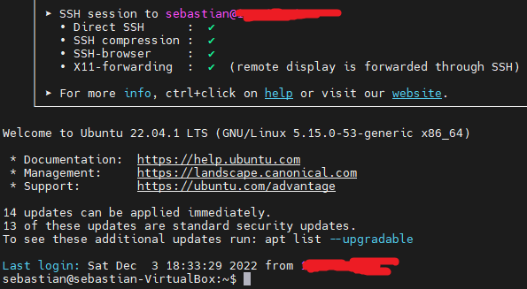

2.	Zainstalowany git, generator kluczy ssh- git version oraz sprawdzenie generując klucz
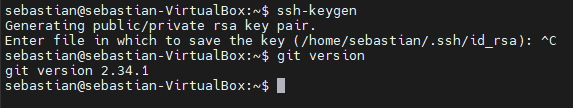

3.	Git clone HTTPS- git clone i link do strony z repozytorium

4.	2 rodzaje kluczy zabezpieczone hasłem- polecenie ssh-keygen. Klucz ecdsa i dsa 
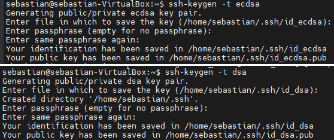

		Skonfigurowany dostęp za pomocą klucza- w ustawieniach github
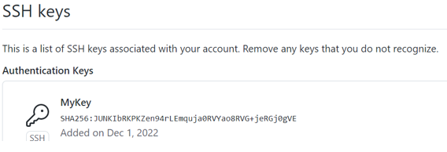	
		
		Klonowanie przy SSH- z repozytorium z github przy odpowiedniej opcji

5.	Gałąź mojej grupy- polecenie git branch --all, git checkout GCL1, git fetch 
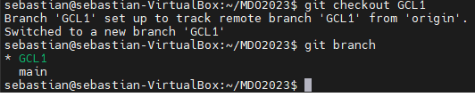

6.	Utworzenie mojej gałęzi- git branch SG287586

7.	Utworzenie mojego katalogu- git checkout SG287586, cd GCL1, mkdir SG287586
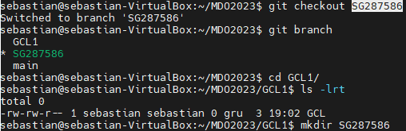

		Dodanie pliku ze sprawozdaniem- vi 1sprawozdanieGrabowski.md
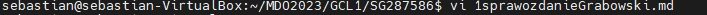
		
		SS przesłane za pomocą SCP- scp do katalogu 1SS
		

		Wysłanie zmian do zdalnego źródła git add ./ ; git commit -m "First step commit to remote repository- screenshots and statement" ;
			git push --set-upstream origin SG287586

				
		Wciągniecie mojej gałęzi do gałęzi grupowej: git checkout GCL1, git merge SG287586 
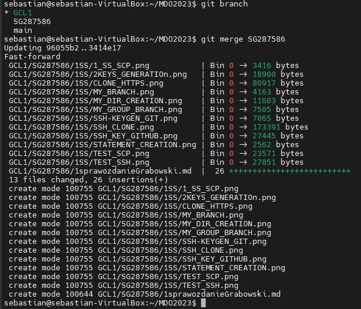

		Oznaczenie tagiem ostatni commit: git tag SGTAG HEAD, git log (do sprawdzenia), git push --tags

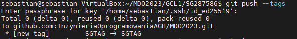

 
		Utworzenia hooka: hook tworzę w katalogu /home/sebastian/MDO2023/.git/hooks o nazwie commit-msg, zmieniam
                        uprawnienia chmod 700 commit-msg. 

		Zawartość pliku:

	                               #!/bin/bash
                                        
					pattern='^devops'
				
					if ! grep -iq "$pattern" "$1"; then
					        echo "Niepoprawny message- pierwsze slowo powinno zawierac devops"
					        exit 1;
					fi

					echo "Poprawna commit message"
                                	
                        Definiuję środowisko bash. Definiuję pattern to szukane słowo devops (1 słowo pliku). W if
			sprawdzam (neguję na początku) za pomocą grep z opcją -i ignorująca wielkośc liter, z opcją 
			-q pracująca w trybie silent i szukam zmiennej pattern w $1 (czyli w commit message, która 
			przekazywana jest jako argument, ścieżka do pliku). Jeśli nie zawiera to anuluję commit 
			i zwracam komentarz, a jeśli jest ok to akcpetuję i zwracam poprawny komentarz.  
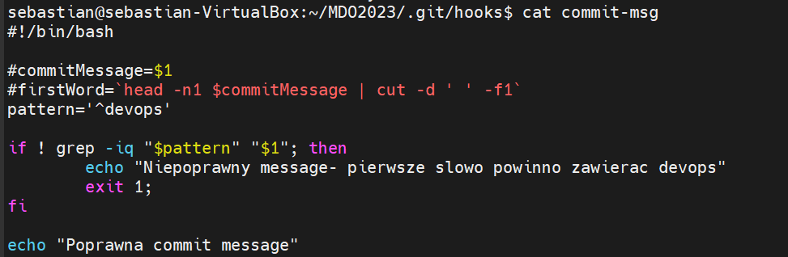

		Dodawanie prefix devops do commit message- tworze plik touch prepare-commit-msg, nadaje mu 
		odpowiednie uprawnienia chmod 700 prepare-commit-msg. W samym skrypcie tak jak poprzednio 
		sprawdzam czy pattern jest na 1 miejscu w commit message. Jeśli nie ma to dodaję go do commit
		message za pomocą polecenia sed. 

					#!/bin/bash

					pattern='^devops'

					if ! grep -iq "$pattern" "$1"; then
					        echo "Dodaje prefix dev ops"
					        sed -i '1i devops' $1
					fi
 
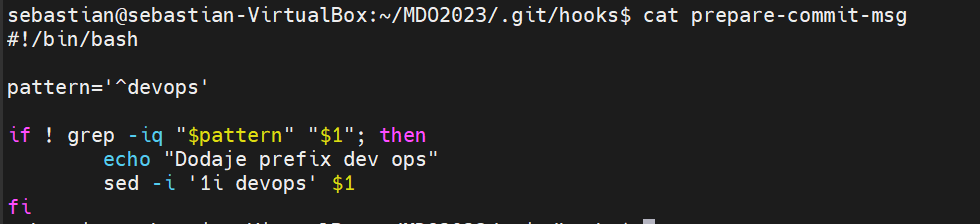
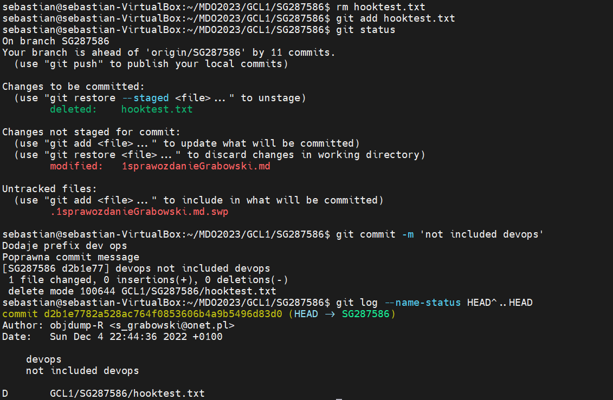

Dostęp do maszyny wykazany w pierwszym punkcie- wirtualizację obsługuje Virtual Box, dostęp poprzez MobaXterm

Docker zainstalowany: sebastian@sebastian-VirtualBox:~$ docker --version
Docker version 20.10.12, build 20.10.12-0ubuntu4

Docker działający serwis- sudo systemctl status docker
● docker.service - Docker Application Container Engine
     Loaded: loaded (/lib/systemd/system/docker.service; enabled; vendor preset: enabled)
     Active: active (running) since Mon 2022-12-05 17:22:42 CET; 1min 5s ago

Wykazanie praktyczne: docker run -i --tty a8780b506fa4 bash (podaje id obrazu ubuntu pobranego docker pull ubuntu). I w środku kontenera polecenie uname -a oraz polecenie
docker ps -a do weryfikacji działania. 
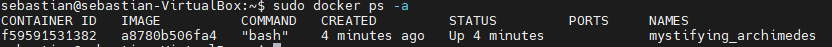
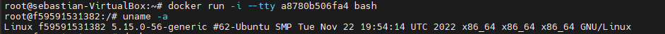

Zarejestrowałem się na DockerHub

