# Sprawozdanie z zajęć 1.
> Wykonał Michał Prochwicz
W przeprowadzanym ćwiczeniu użyto Ubuntu, do którego łączono się przez ssh z systemu Windows.
1. Komunikacja ze środowiskiem linuxowym.
* Użyto programu VirtualBox do wirtualizacji systemu linux, zapewniając mu dostęp do sieci lokalnej:\
 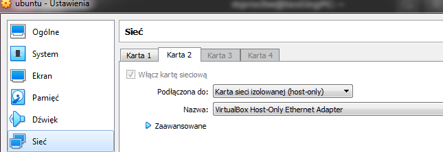
 * Wtedy system można było znaleźć pod tym adresem:\
 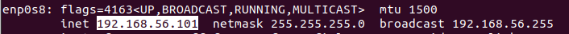
 * Pozwoliło to na połączenie przez SSH, z użyciem programu PuTTY:\
 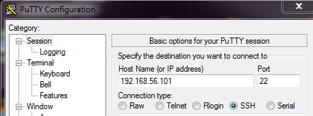
 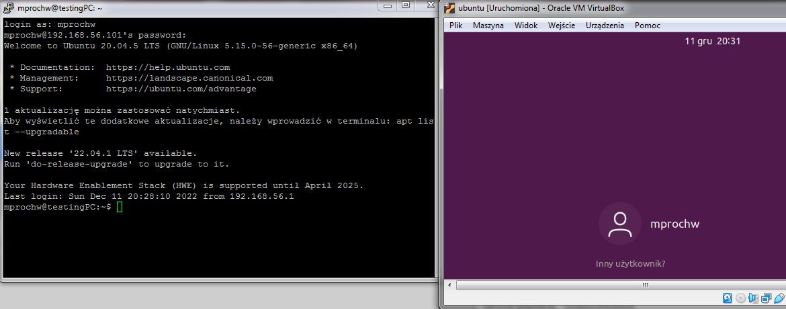
  * Możliwe stało się również przesyłanie plików dzięki SFTP, z użyciem programu FileZilla:\
 
2. Zainstalowano klienta gita i obsługę kluczy SSH:\
 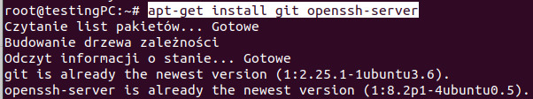
3. Na wirtualnej maszynie sklonowano repozytorium przedmiotu, przy pomocy HTTPS:\
 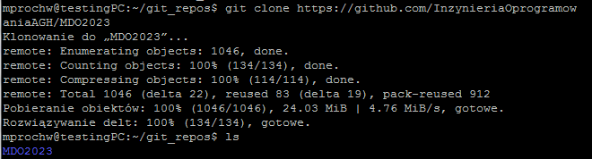
4. Przy pomocy wygenerowanych kluczy SSH ponownie sklonowano repozytorum, już jako uczestnik organizacji.
 * Utworzono dwa klucze SSH, zabezpieczone hasłem. Najpierw klucz typu ED2559:\
 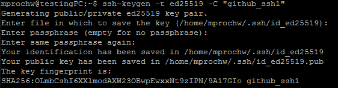
 * Następnie klucz typu ECDSA:\
 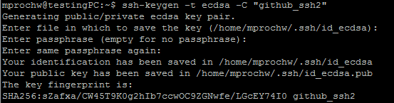
 * Kolejno dodano klucze do konta GitHub:\
 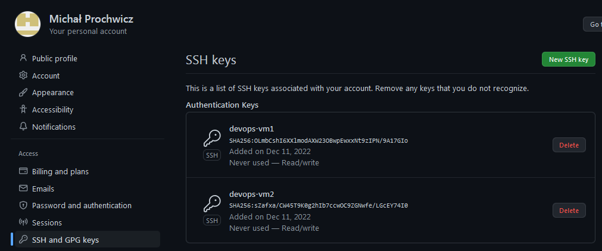
 * Wtedy przy pomocy jednego z nich skopowano repozytorum przez SSH:\
 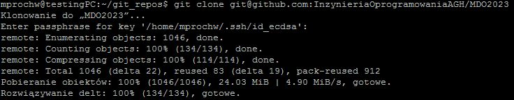
5. Przełączono się na gałąź grupową\
 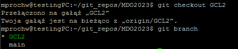
6. Następnie utworzono własną gałąź\
 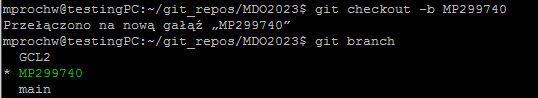
7. Praca na nowej gałęzi
 * Na własnej gałęzi utworzono strukturę plików zawierającą plik ze sprawozdaniem oraz katalog ze zrzutami ekranu:\
 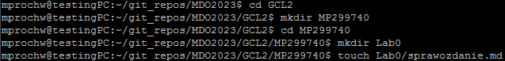
 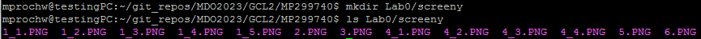
 * Powyższe zmiany przesłano do zdalnego źródła:\
 
 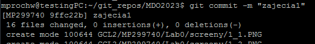
 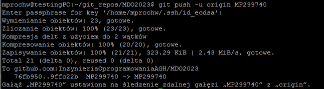
 * Przy próbie wciągnięcia własnej gałęzi do grupowej, wymagane jest zatwierdzenie ich połączenia:\
 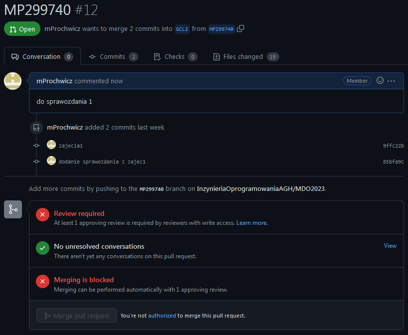
 * Oznaczenie tagiem ostatniego commita:\
 
8. Hooki w lokalnym repozytorium.
 * Utworzony hook, sprawdzający czy wiadomość commita zawiera nazwe przedmiotu:\
 
 * Oraz taki, który ustawia nazwę przedmiotu jako prefix wiadomości:\
 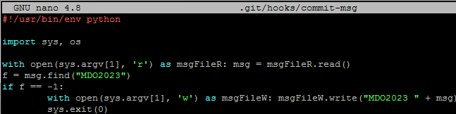
9. Instalacja i sprawdzenie środowiska dockerowego:\
 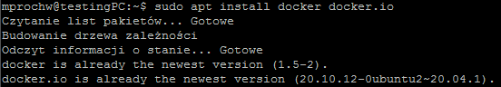
 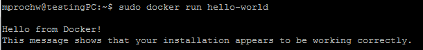 
