# Sprawozdanie Zajęcia 02

### Zestawienie środowiska

1) Zainstaluj Docker w systemie linuksowym

Docker został zainstalowany na potrzeby poprzedniego laboratorium: 

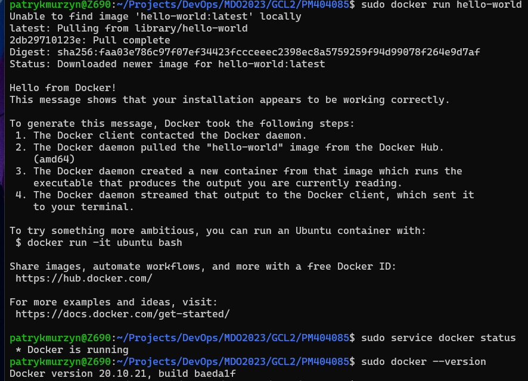

2) Zarejestruj się w Docker Hub i zapoznaj z sugerowanymi obrazami

Link do profilu: https://hub.docker.com/u/patrykmurzyn

3) Pobierz hello-world, busybox, ubuntu lub fedorę, mysql

Instalujemy wymienione obrazy za pomocą polecenia docker pull <nazwa>

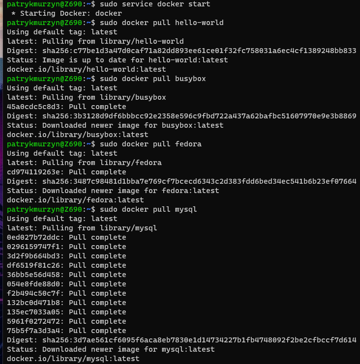

4) Uruchom busybox

* Pokaż efekt uruchomienia kontenera
* Podłącz się do kontenera interaktywnie i wywołaj numer wersji
	
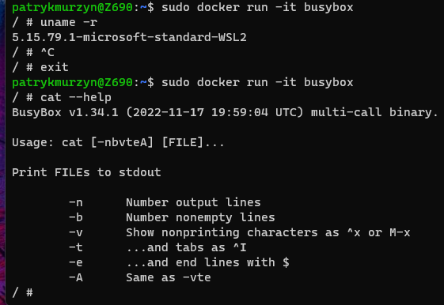
	
5) Uruchom "system w kontenerze"

Uruchomiłem system Fedora oraz zainstalowałem pakiet procps z którego skorzystam w kolejnym podpunkcie.

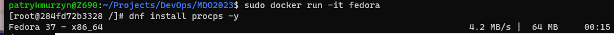

* Zaprezentuj PID1 w kontenerze i procesy dockera na hoście
	
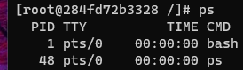
	
* Zaktualizuj pakiety
	
Zaktualizowałem pakiety korzystając z polecenia:
```
dnf upgrade
```
	
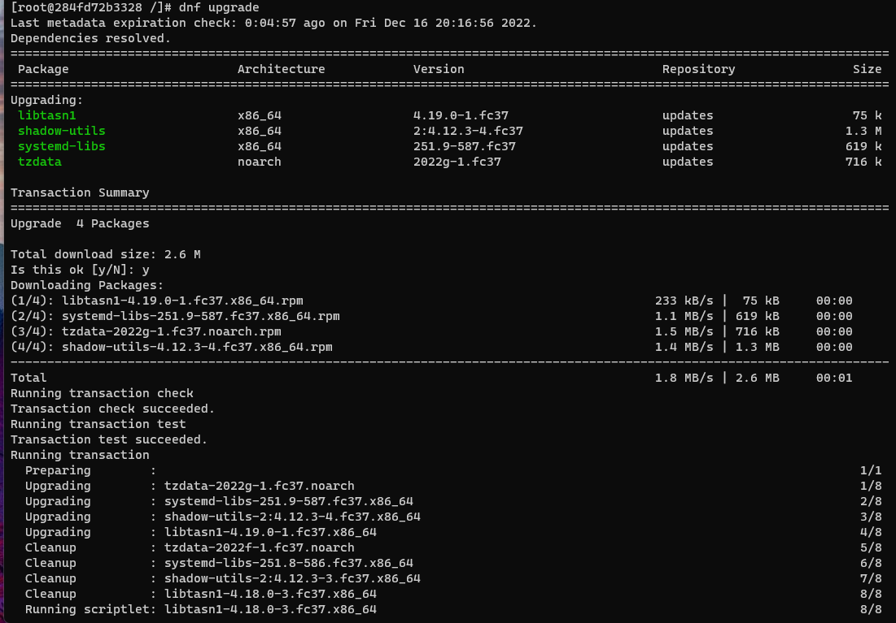
	
* Wyjdź
	
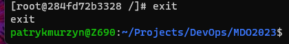
	
6) Pokaż uruchomione ( != "działające" ) kontenery

Pokazanie uruchomionych kontenerów:

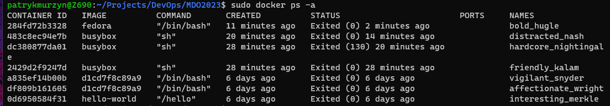

7) Wyczyść obrazy

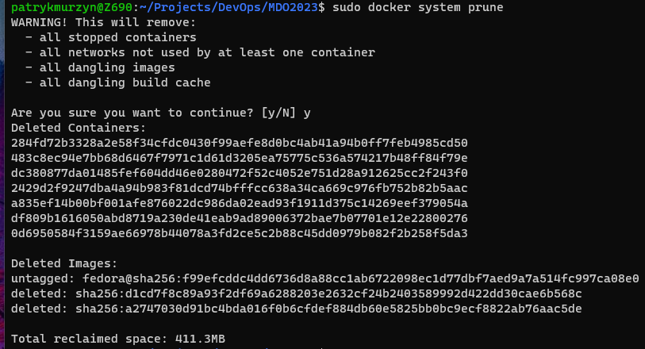

### Budowanie programu

1) Znajdź projekt umożliwiający łatwe wywołanie testów jednostkowych

Znalazłem projekt napisany w JS z prostym opisem funkcjonalności: https://github.com/MarcL/js-unit-testing-examples

2) Przeprowadź budowę/konfigurację środowiska

Postępując zgodnie z instrukcją projektu wykonujemy kolejno:
```
git clone git@github.com:MarcL/js-unit-testing-framework.git
npm install
```

Podczas installacji zależności npm napotkałem problem:

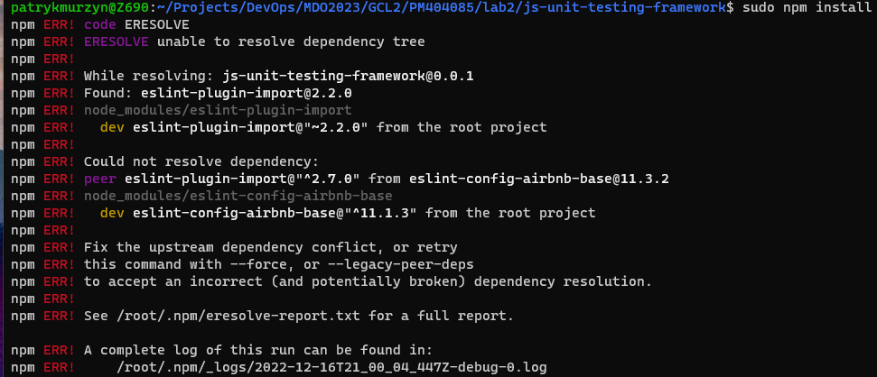

Który został naprawiony poprzez wywołania polecenia:

```
npm install --save --legacy-peer-deps
```

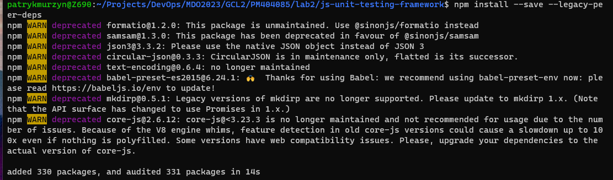

3) Uruchom testy

Uruchomiłem testy poprzez wywołanie:
```
npm test
```

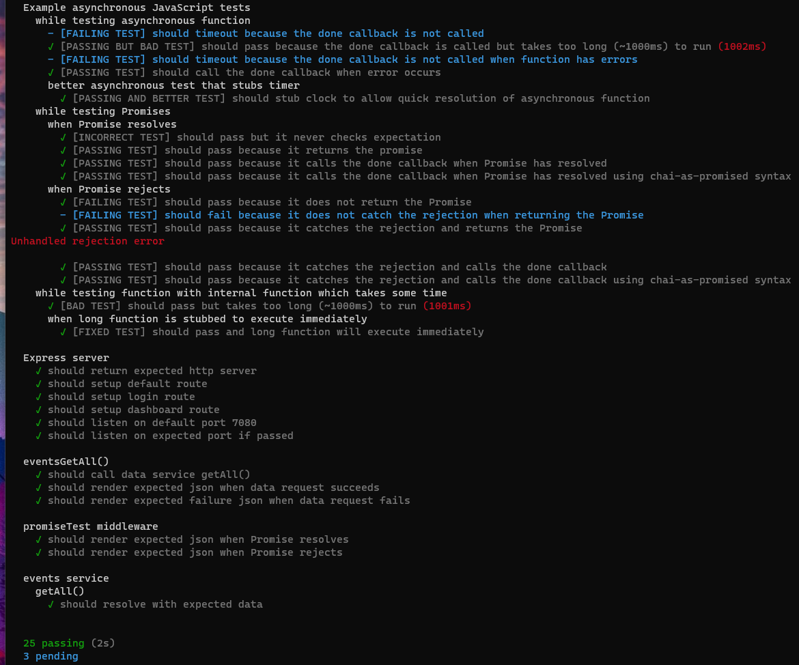

