ZESTAWIENIE ŚRODOWISKA:
1. Zainstaluj docker w systemie linuxowym

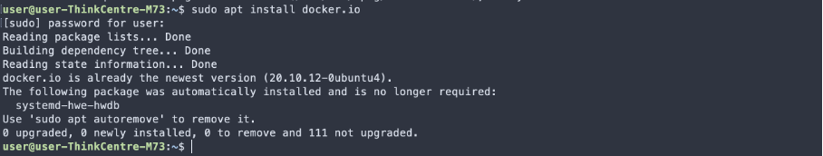

2. Pobierz obrazy hello-world, busybox, ubuntu lub fedore, mysql, z punktu wyrzej konto na dockerhub podlinkowe w sprawku z lab1

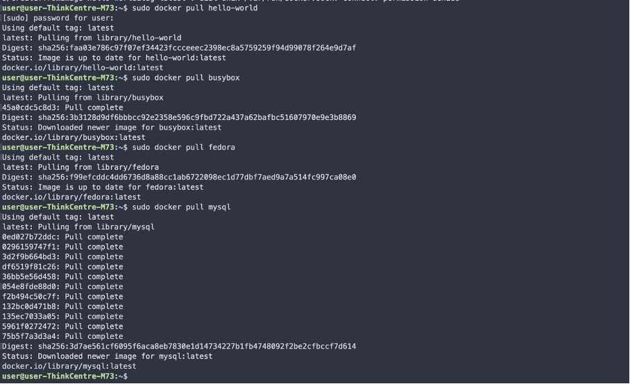

3. Uruchom busybox, pokaż efekt uruchomienia kontenera, podłącz się do kontenera interaktywnie i wywołaj numer wersji

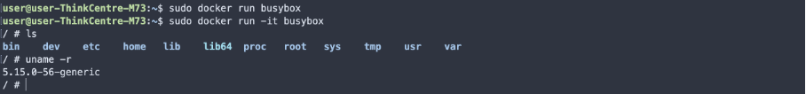

4. Uruchom "system w kontenerze" (zakładam że chodzi o dowolny obraz z systemem) zaprezentuj PID1 w kontenerze i procesy dockera na hoście, zaktualizuj pakiety, wyjdź

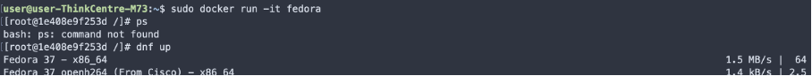
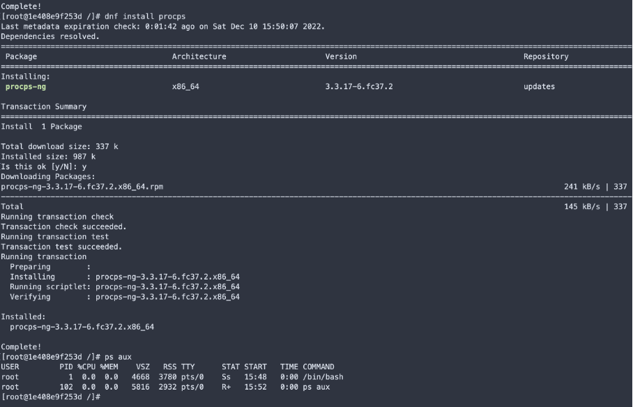
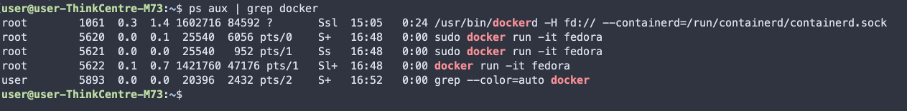

5. Pokaż uruchomione (!= działające) kontenery, wyczyść je (tutaj zamiast wywoływania docker rm z nazwą obrazów po kolei połączyłem to z kolejnym punktem "wyczyść obrazy" i uruchomiłem docker prune -a

BUDOWANIE PROGRAMU:

1. Znajdź projekt umożliwiający łatwe wywołanie testów jednostokowych, przeprowadź budowę środowiska, uruchom testy
Użyłem do tego naszego innego prostego programu napisanego na inne zajęcia, posiada on proste testy więc powinien być wystarczający: https://github.com/michonszy/Logistyka_CPM

Aby wszystko działało jak należy zainstalowałem pythona, pip, make i za pomocą gotowego makefile wszelkie zależności

 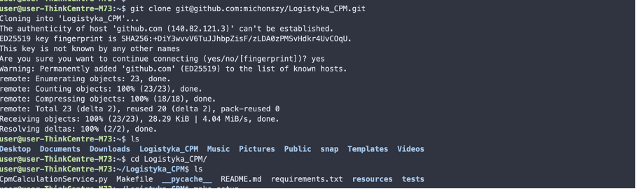
 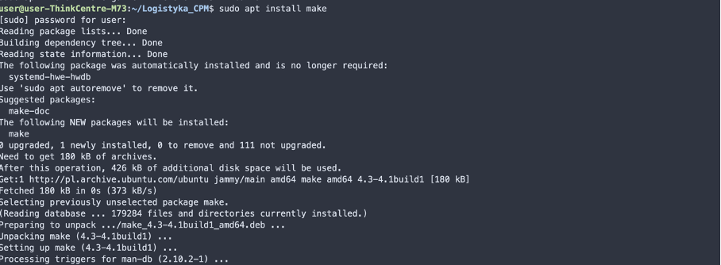 
 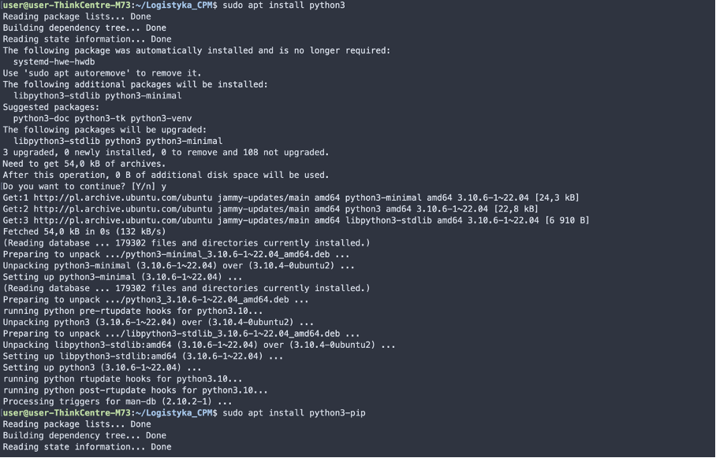 
 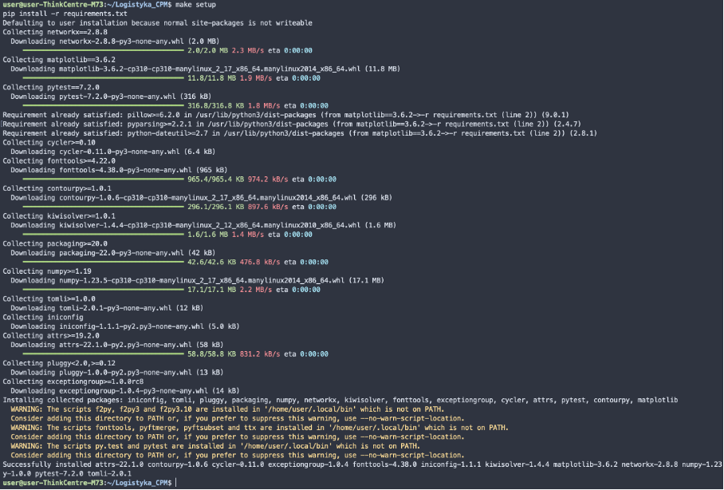

Następnie mogłem wykonać make build i make tests

 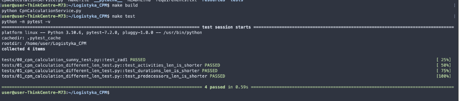

2. Ponów ten proces w kontenerze. Wybrałem ubuntu jako bazowy system, zainstalowałem potrzebne oprogramowanie, sklonowałem aplikacje z gita, uruchomiłem aplikacje i testy

 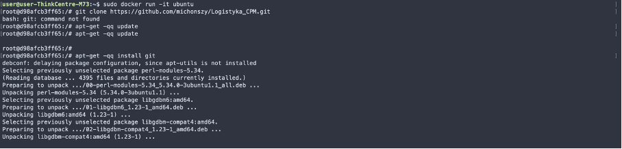 

 

3. Utwórz Dockerfile wykonujący powyższe kroki i zaprezentuj jego działanie, tylko budowanie bez testów

 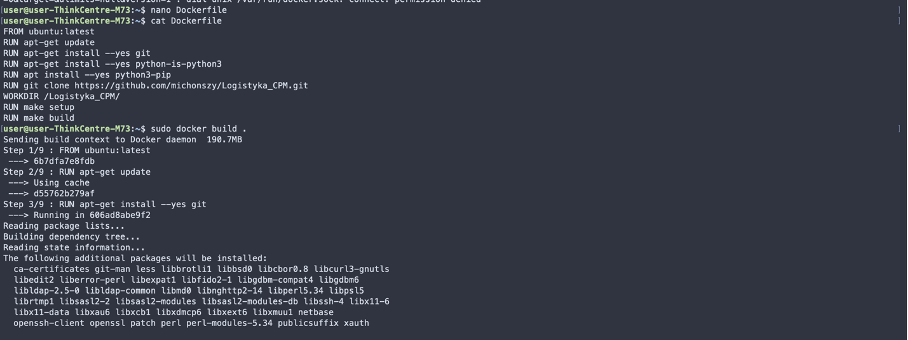

 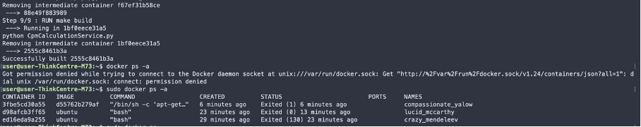

Po uruchomieniu docker ps -a nie widać tego kontenera pomimo, że wykonał swoją pracę ponieważ build jedynie tworzy obraz, jak chce uruchomić kontener na bazie tego obrazu musze wykonać docker run

 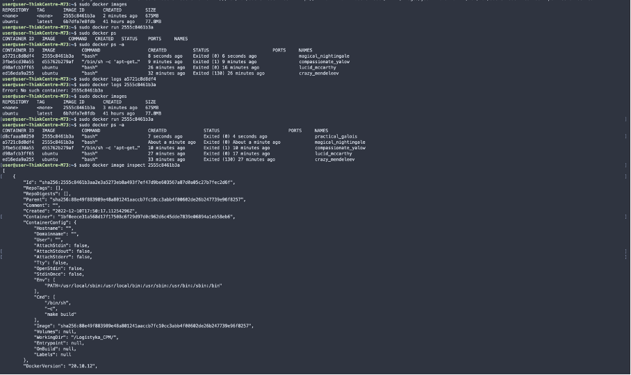

4. Stwórz drugi Dockerfile na bazie pierwszego który dodatkowo wykona testy. Aby to zrobić używam pierwszego obrazu i podaje go w dockerfile, dodaje jedynie wykonanie testów

 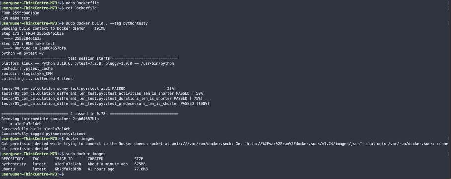 

RUNDA BONUSOWA - kompozycja

Instaluje docker compose

 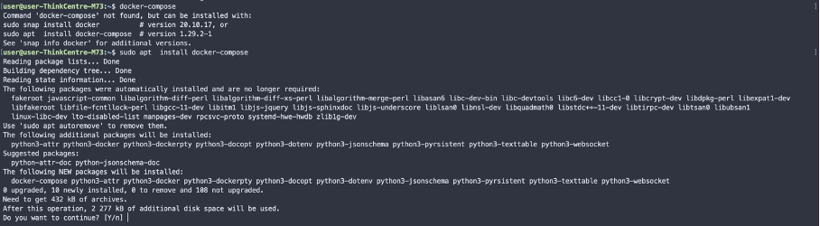 

Tworze plik .ylm i wykonuje docker-compose

 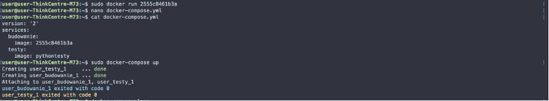 

       
