Sprawozdanie Zajęcia lab 01
2022-11-26
Szymon Michoń 404665

Setup:
Komputer lokalny: MacOS
Serwer zdalny: Ubuntu 22.04, natywny, w tej samej sieci lokalnej
Sposób połączenia: Terminal (ZSH)

NIEKTÓRE SCREENSHOTY SĄ POUCINANE W CELU ZASŁONIENIA DANYCH PRYWATNYCH JAK NP. WARTOŚCI KLUCZY

Weryfikacja sprawności środowiska UNIX
1.	Wykaż możliwość komunikacji ze środowiskiem linuksowym
SSH:
 
SFTP:
 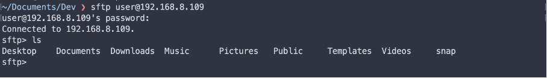

2.	Zainstaluj klienta Git

 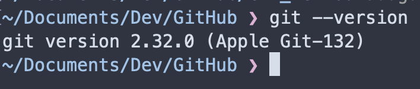

3.	Sklonuj repozytorium za pomocą HTTPS
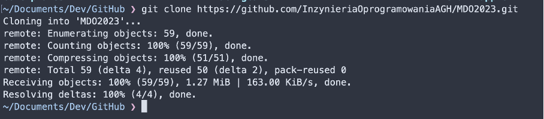
 
4.	Stworzenie kluczy innych niż RSA (definiowane za pomocą -t), zabezpieczone hasłami, dodane do GitHuba, sklonowanie za pomocą ssh
 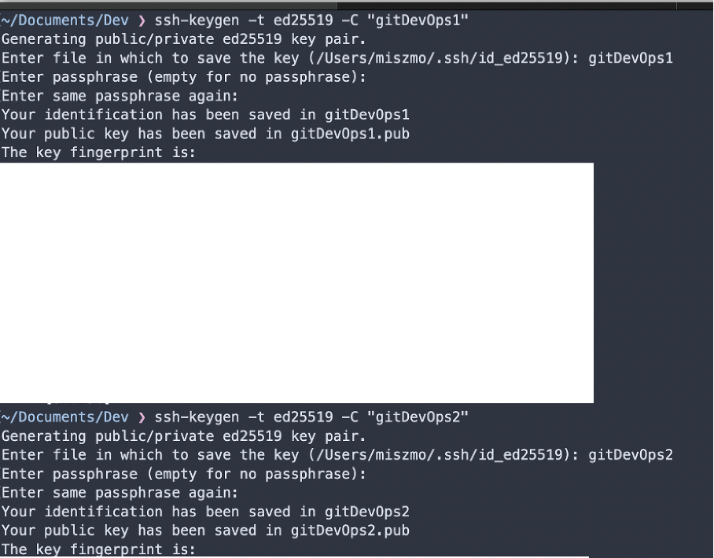
 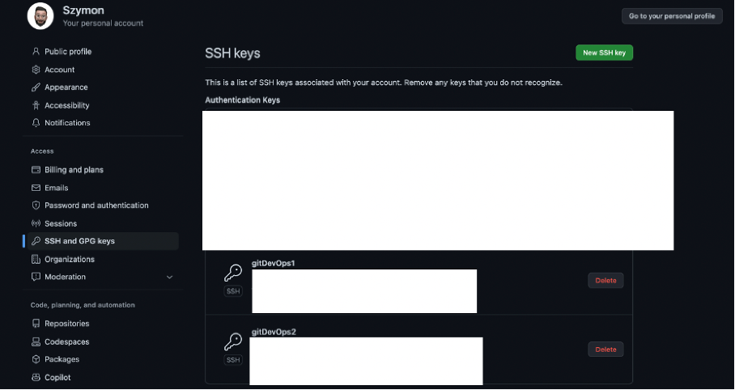
 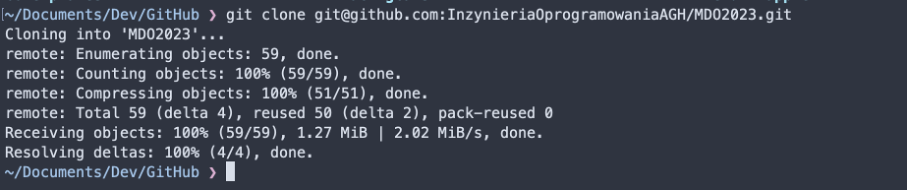 
 

5.	Przyłączyłem się do swojej grupy, stworzyłem gałąż SM404665
 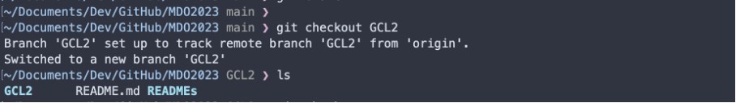
 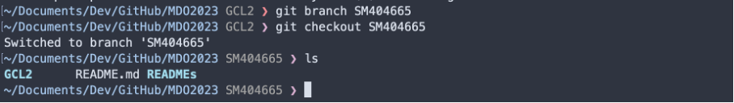
 
6.	Utworzyłem katalog SM404665 w którym umieszczę te sprawozdanie
 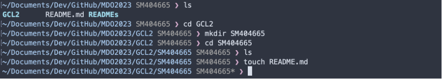
7. Dodaje zdjęcie commita i dodaje kolejnego commita jak w instrukcji
 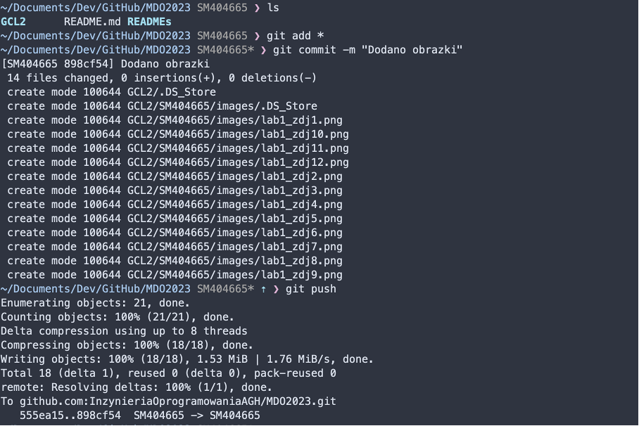
 
 Dodałem hooki

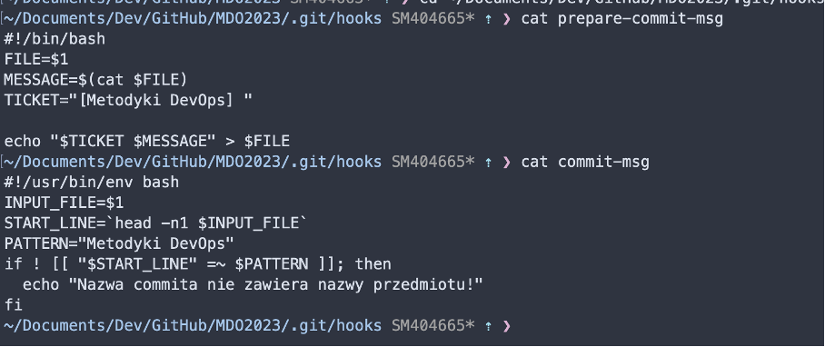

Weryfikacja działania środowiska konteneryzacji
1.	Mam dostęp po SSH, jak wykazałem powyżej jest to serwer z zainstalowanym natywnie ubuntu w tej samej sieci lokalnej do którego łączę się terminalem, zainstalowałem na nim dockera
 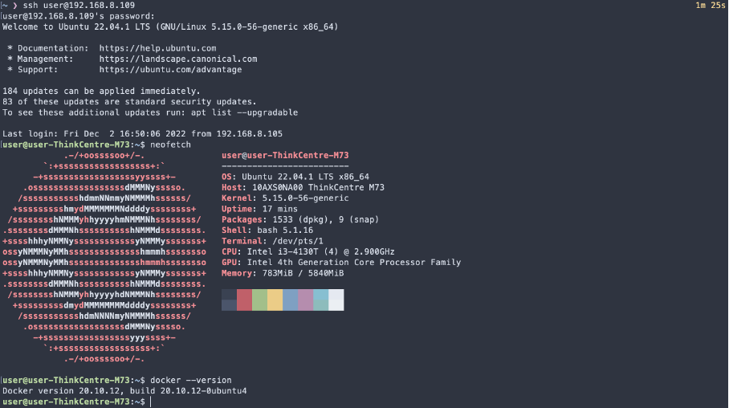

2.	Środowiska dockerowe działa, pobrałem obraz fedora w wersji latest
 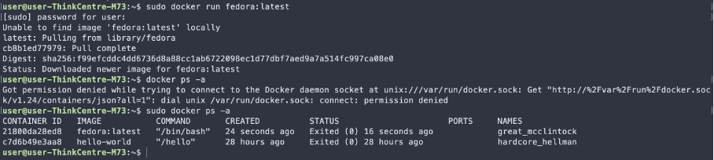

3.	Zalogowałem się do posiadanego konta na Docker Hub link do profilu https://hub.docker.com/u/michonszy

