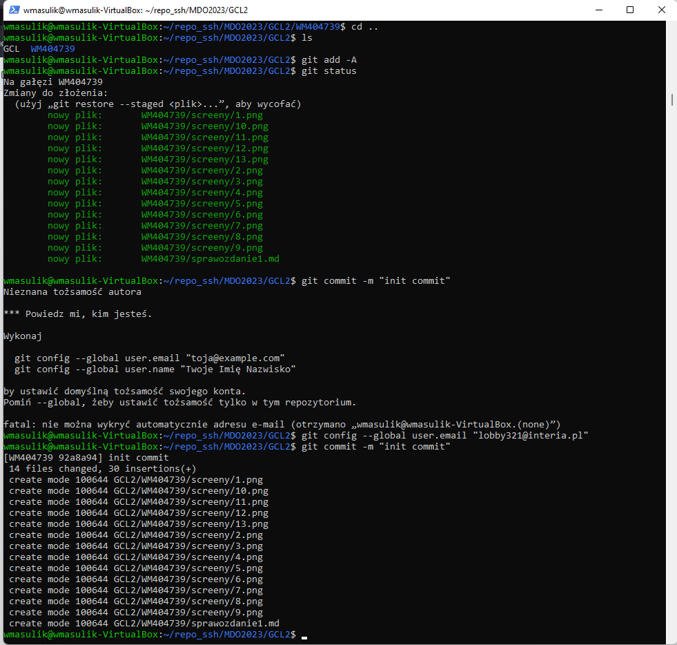
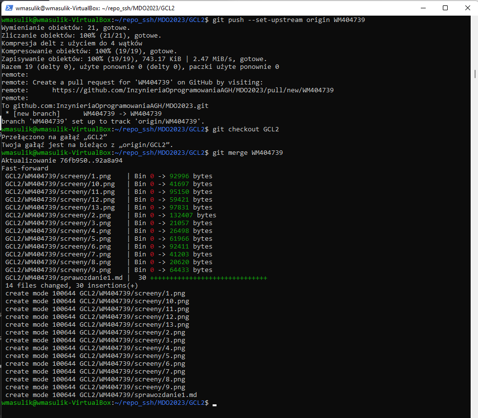
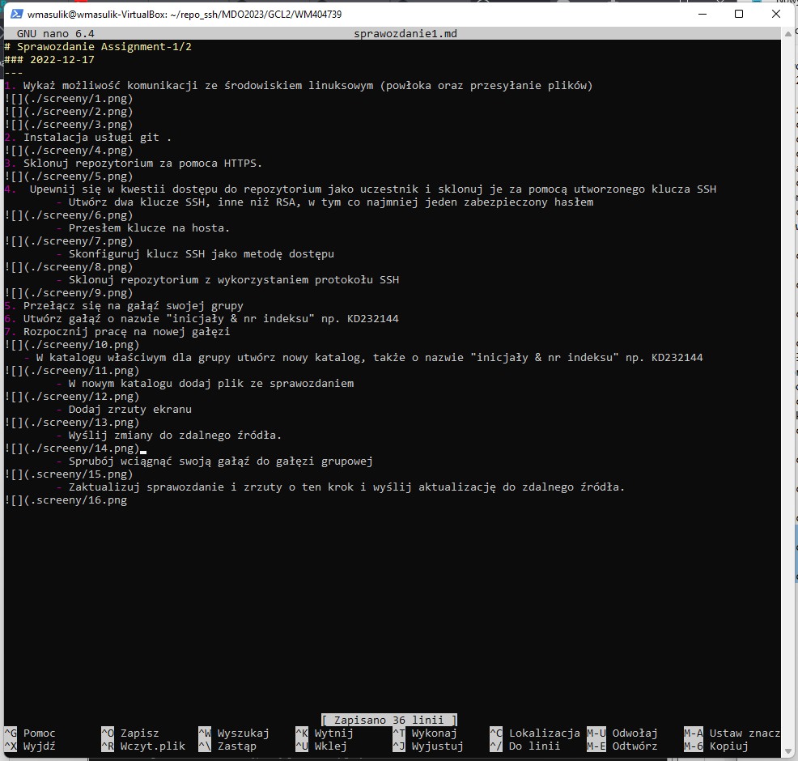
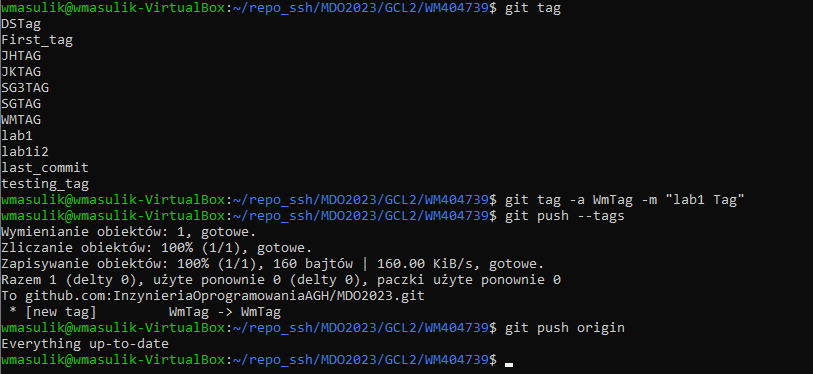

# Sprawozdanie Assignment-1/2
### 2022-12-17
---
1. Wykaż możliwość komunikacji ze środowiskiem linuksowym (powłoka oraz przesyłanie plików)
 

2. Instalacja usługi git .
 
3. Sklonuj repozytorium za pomoca HTTPS.
 
4.  Upewnij się w kwestii dostępu do repozytorium jako uczestnik i sklonuj je za pomocą utworzonego klucza SSH 
	- Utwórz dwa klucze SSH, inne niż RSA, w tym co najmniej jeden zabezpieczony hasłem 
 
	- Przesłem klucze na hosta.

	- Skonfiguruj klucz SSH jako metodę dostępu
 
	- Sklonuj repozytorium z wykorzystaniem protokołu SSH
 
5. Przełącz się na gałąź swojej grupy 
6. Utwórz gałąź o nazwie "inicjały & nr indeksu" np. KD232144
7. Rozpocznij pracę na nowej gałęzi
 
   - W katalogu właściwym dla grupy utwórz nowy katalog, także o nazwie "inicjały & nr indeksu" np. KD232144 

	- W nowym katalogu dodaj plik ze sprawozdaniem

	- Dodaj zrzuty ekranu 

	- Wyślij zmiany do zdalnego źródła 

	- Spróbuj wciągnąć swoją gałąź do gałęzi grupowej  

	- Zaktualizuj sprawozdanie i zrzuty o ten krok i wyślij aktualizację do zdalnego źródła (na swojej gałęzi)

	- Oznacz tagiem ostatni commit i wypchnij go na zdalną gałąź

	- Ustall hool, ktory bedzie sprawdzal, czy wiadomosc z commitem zawiera nazwe przedmiotu

	- Hook, ktory bedzie ustawial prefiks wiadomosci commitu tak, by mial nazwe przedmiotu.

# Weryfikacja działania środowiska konteneryzacji.
1. Rozpocznij przygotowanie środowiska Dockerowego
	- zapewnij dostęp do m aszyny wirtualnej przez zdany terminal 
	- zainstaluj środowisko dockerowe w stosowanym systemie operacyjnym
2. Działanie środowiska 

3. Załóż konto na Docker Hub. Zadbaj o 2FA (niestety nie dałem rady jeszcze zainstalować aplikacji 
Docker Hyba na iOS'a)

