# Sprawozdanie 01 - Wprowadzenie, Git, Gałęzie, SSH
### 2022-11-26
---
1. Wykaż możliwość komunikacji ze środowiskiem linuksowym (powłoka oraz przesyłanie plików)

    Instalacja SSH przed zajeciami
    
    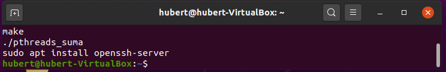

    Sprawdzenie statusu SSH
    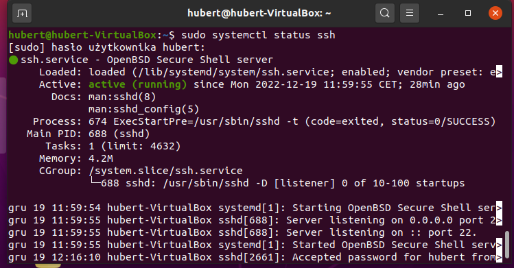

    Sprawdzenie adresu naszej maszyny
    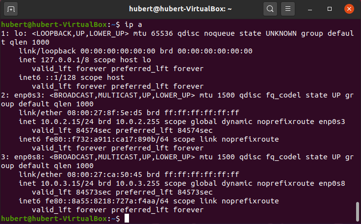

    Komunikacja SSH
    

    Przesył danych po ówczesnym zalogowaniu używając sftp

    Przesył danych z hosta
    
    Presył danych do hosta
    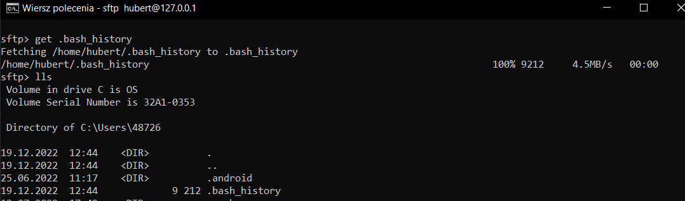
2. Zainstaluj klienta Git i obsługę kluczy SSH 

    Instalacja GIT
    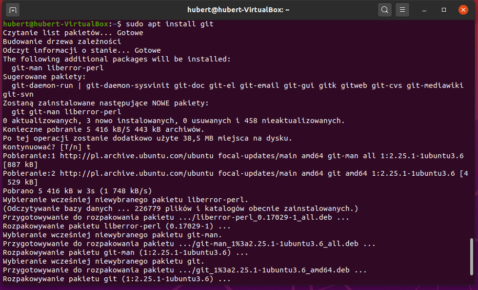

    Sprawdzenie poprawnoscsi instalacji
    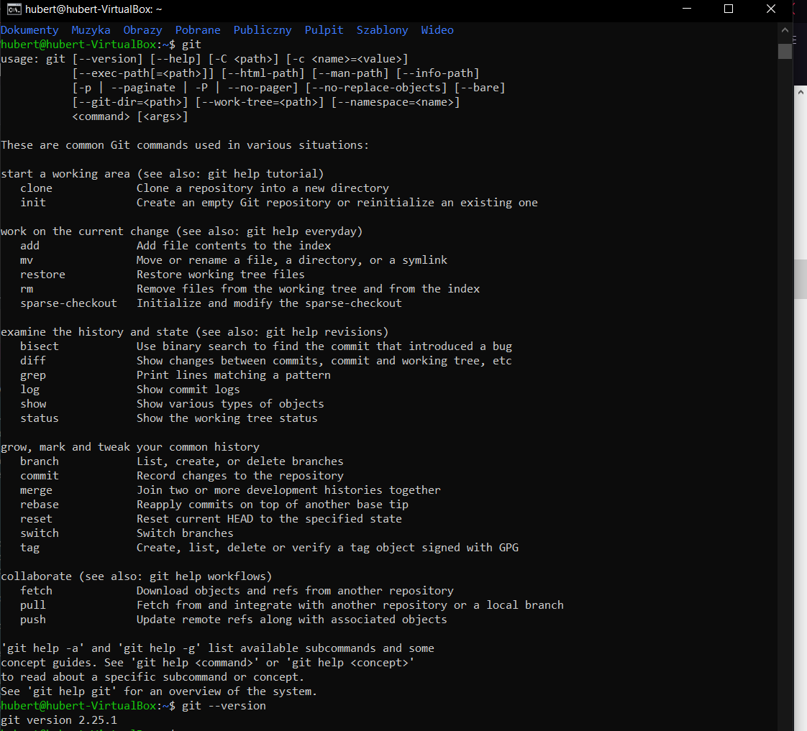

3. Sklonuj repozytorium https://github.com/InzynieriaOprogramowaniaAGH/MDO2023 za pomocą HTTPS

    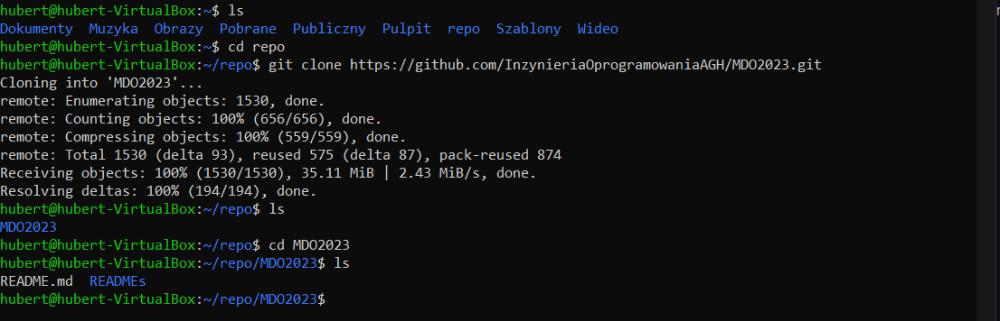

4. Upewnij się w kwestii dostępu do repozytorium jako uczestnik i sklonuj je za pomocą utworzonego klucza SSH 

    Bez hasła 
    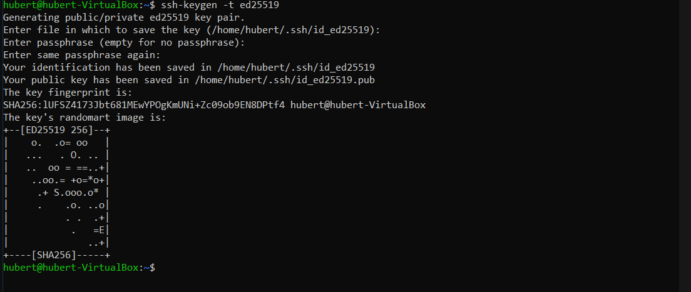

    Z hasłem
    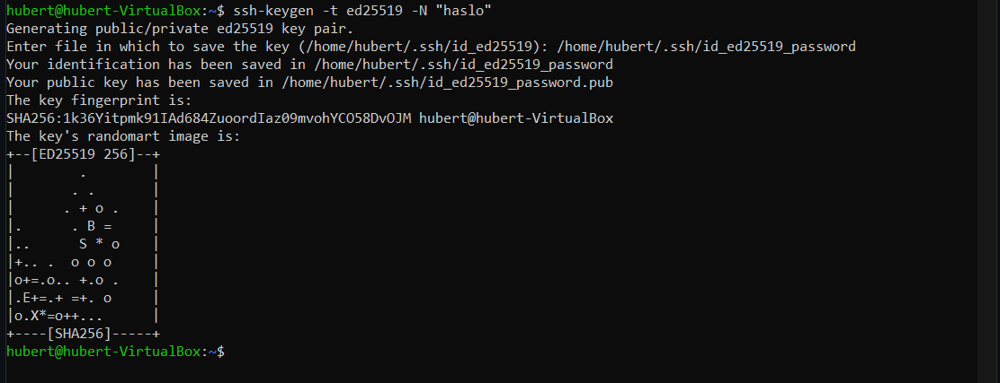

    Przeniesienie kluczy na hosta używając sftp
    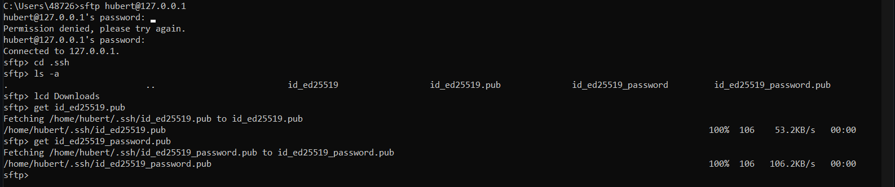

    Konfiguracja SSH GitHub
    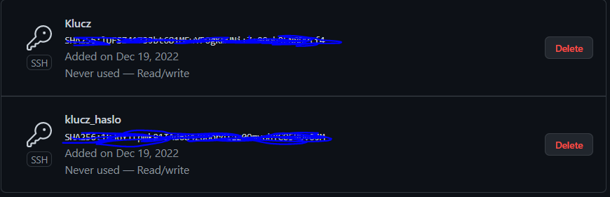

    Klonowanie repozytorium z wykorzystaniem SSH 
    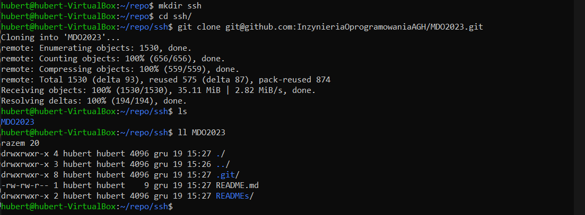

5. Przełącz się na gałąź swojej grupy

    Dostępne BRANCH
    
    
    Wybieramy gałąź GCL3
    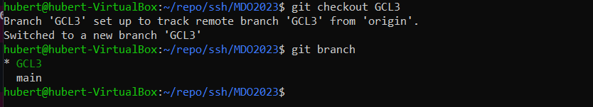

6. Utwórz gałąź o nazwie "inicjały & nr indeksu" np. KD232144
    

7. Rozpocznij pracę na nowej gałęzi
    - W katalogu właściwym dla grupy utwórz nowy katalog, także o nazwie "inicjały & nr indeksu" np. KD232144
        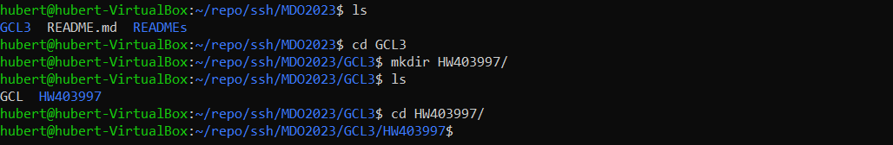
    - W nowym katalogu dodaj plik ze sprawozdaniem
        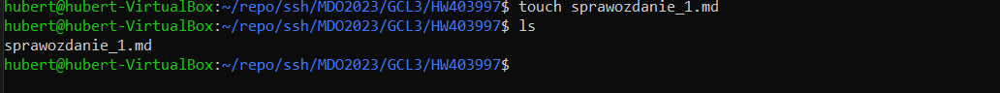
    - Dodaj zrzuty ekranu
        
        
    - wysylanie zmian
        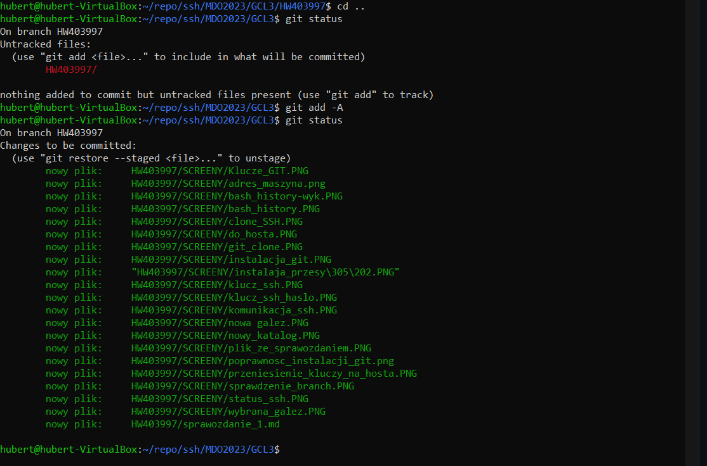
    - dodanie pierwszego comita
        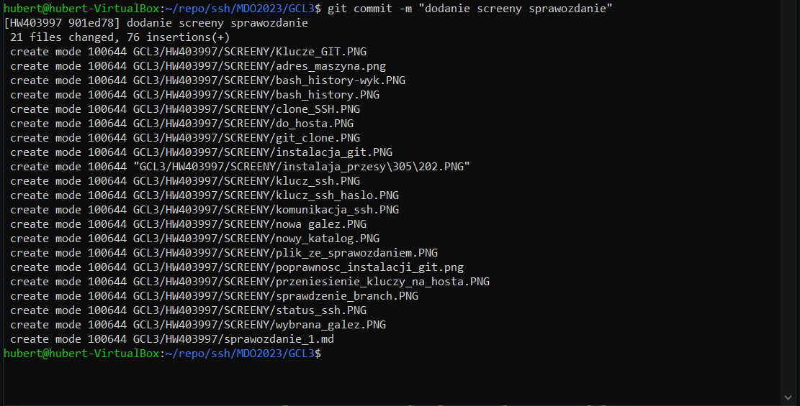
    - wypchniecie zmian na serwer
        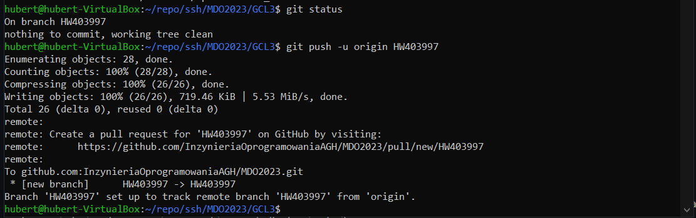

    - wyciaganie: gałąź do gałęzi grupowej

    edit

