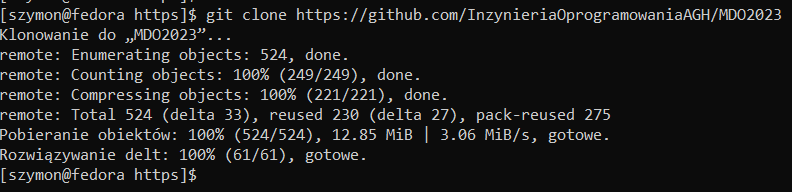
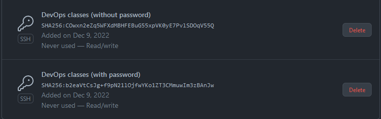
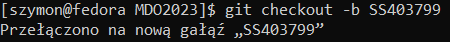
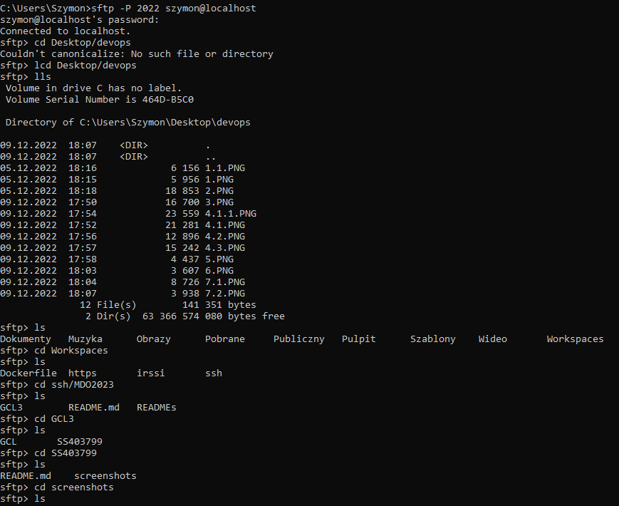
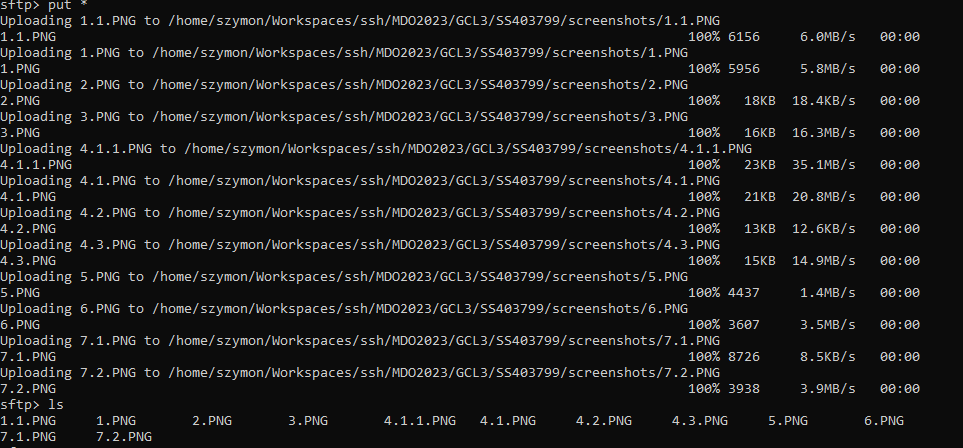
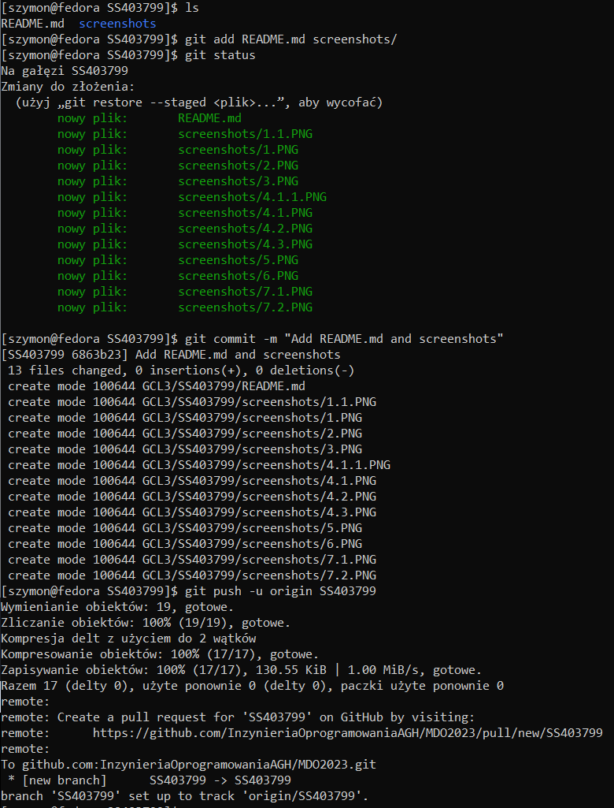
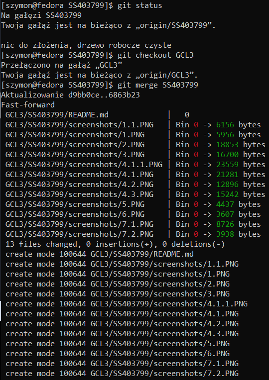

# Szymon Sawis 403799
---

## 1. Wykaż możliwość komunikacji ze środowiskiem linuksowym
Powłoka

Przesyłanie plików

## 2. Instalacja gita

## 3. Klonowanie repo za pomocą HTTPS

## 4. Utworzenie dwóch kluczy ed25519
Bez hasła

Z hasłem

##5. Przełączenie na gałąź mojej grupy
)

## 6. Utworzenie gałęzi o nazwie SS403799

## 7. Praca na gałęzi
Utworzenie katalogu o nazwie SS403799

Dodanie pliku ze sprawozdaniem

Dodanie zrzuty ekranu

Wysłanie zmian do zdalnego źródła

Wciągniecie gałęzi SS403799 do gałęzi GCL3

