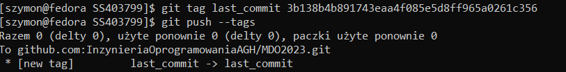
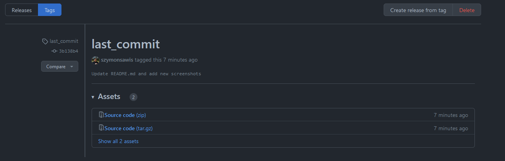
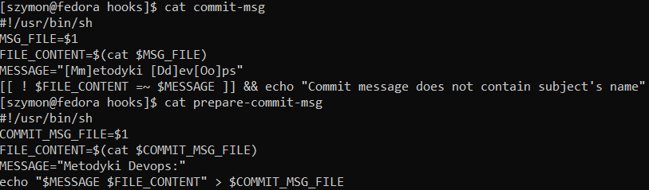
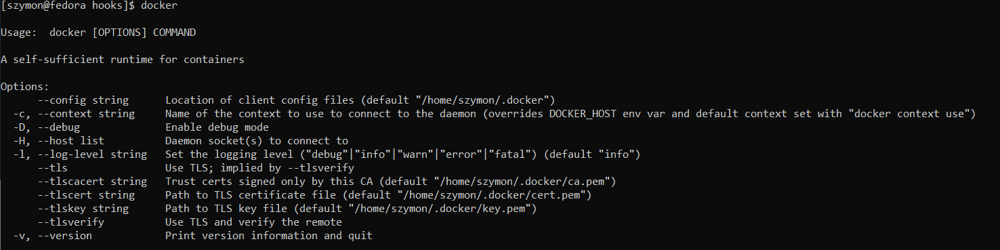
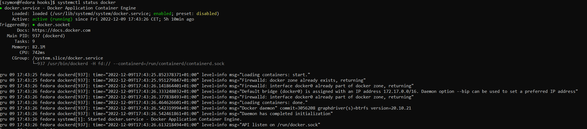
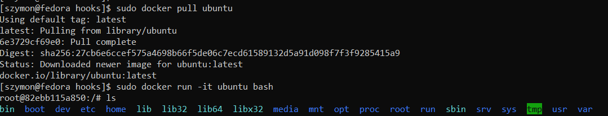
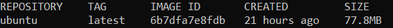

# Szymon Sawis 403799
---
# Weryfikacja sprawności środowiska UNIX  

## 1. Wykaż możliwość komunikacji ze środowiskiem linuksowym
Powłoka  
  

Przesyłanie plików  
  

## 2. Instalacja gita
  

## 3. Klonowanie repo za pomocą HTTPS
  

## 4. Utworzenie dwóch kluczy ed25519
Bez hasła  
  

Z hasłem  
  

## 5. Przełączenie na gałąź mojej grupy
  

## 6. Utworzenie gałęzi o nazwie SS403799
  

## 7. Praca na gałęzi
Utworzenie katalogu o nazwie SS403799  
  

Dodanie pliku ze sprawozdaniem  
  

Dodanie zrzuty ekranu  
  
  

Wysłanie zmian do zdalnego źródła  
  
 
Wciągniecie gałęzi SS403799 do gałęzi GCL3  
  

Oznaczenie ostatniego commita  
    
    

Ustawienie hooka, aby sprawdzał czy commit zawiera nazwę przedmiotu  
Drugi hook, pozwala ustawić prefix commita  
    

---
# Weryfikacja działania środowiska konteneryzacji
## 1. Instalacja dockera
    

## 2. Działanie środowiska
Środowisko dockerowe  
    

Pobranie obrazu Ubuntu i uruchomienie go  
    

Wyświetlenie tagu  
    

## 3. Założenie konta na DockerHub  
    
  

