# Sprawozdanie 01 - Wprowadzenie, Git, Gałęzie, SSH
### 2022-11-26
---
1. Wykaż możliwość komunikacji ze środowiskiem linuksowym (powłoka oraz przesyłanie plików)
Aby umożliwić zdalny dostęp po ssh do naszej maszyny wirtualnej, konieczne jest aby fizycznie się do niej zalogować a następnie za pomocą terminala zainstalować openssh-server.
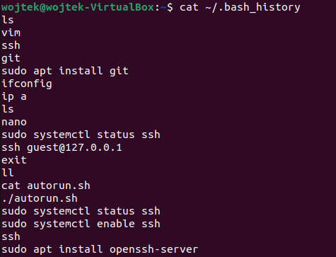

Następnie sprawdzamy status serwera ssh za pomocą następującej komendy (jeśli jest active (running) to jest wszystko w porządku):
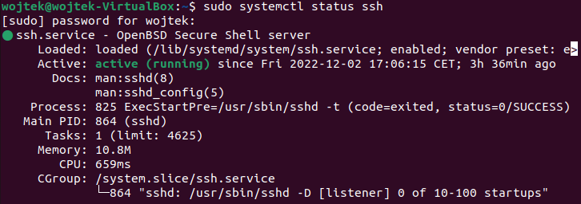

Za pomocą komendy "ip a" sprawwdzamy lokalny adres naszej maszyny i zapamiętujemy go, ponieważ to dzięki niemu będziemy się zdalnie logowali do niej

Możemy opuścić maszynę wirtualną, lecz musi pozostać ona włączona.
Otwieramy terminal tym razem na naszym hoście i logujemy się za pomocą ssh do maszyny:

W drugim terminalu na hoście logujemy się do maszyny przez protokół sftp i sprawdzamy gdzie się znajdujemy (ls dla remote czyli maszyny wirtualnej, lls dla hosta):

Testujemy przesyłanie danych z hosta do remote'a:

Następnie testujemy przesył z remote'a do hosta:

2. Zainstaluj klienta Git i obsługę kluczy SSH
Gita instalujemy za pomocą komendy (niestety screen zrobiony po fakcie, wyciągnięte z bash_history):
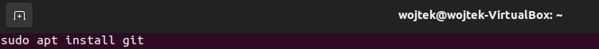

Weryfikujemy czy git został poprawnie zainstalowany
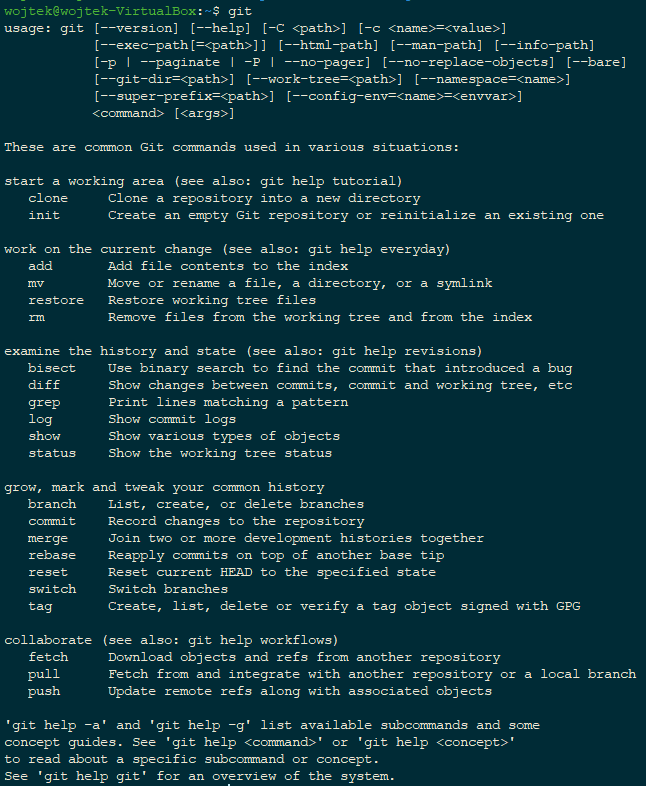

3. Sklonuj repozytorium https://github.com/InzynieriaOprogramowaniaAGH/MDO2023 za pomocą HTTPS
Aby tego dokonać, należy skopiować link do repozytorium - wchodzimy na Githuba do repozytorium InzynieriaOprogramowaniaAGH/MDO2023, klikamy "Code" i kopiujemy link z zakładki "HTTPS". Wchodzimy do folderu gdzie chcemy umieścić sklonowane repozytorium, a następnie doklejamy link na koniec komendy git clone:

4. Upewnij się w kwestii dostępu do repozytorium jako uczestnik i sklonuj je za pomocą utworzonego klucza SSH

- Utwórz dwa klucze SSH, inne niż RSA, w tym co najmniej jeden zabezpieczony hasłem
Klucz ssh tworzymy w następujący sposób:

Klucz ssh zabezpieczony hasłem tworzymy w następujący sposób:

Następnie przenosimy oba klucze publiczne na hosta za pomocą sftp:

- Skonfiguruj klucz SSH jako metodę dostępu
Na hoście logujemy się do Githuba, wchodzimy do Settings - SSH and GPG keys - klikamy New SSH key i kopiujemy zawartość jednego klucza, następnie powtarzamy czynność dla drugiego klucza

- Sklonuj repozytorium z wykorzystaniem protokołu SSH

5. Przełącz się na gałąź swojej grupy
Sprawdzamy obecną gałąź oraz jakie są dostępne gałęzie komendą "git branch -a", a następnie komendą "git checkout <nazwa_brancha>" przełączamy się na wybraną gałąź

6. Utwórz gałąź o nazwie "inicjały & nr indeksu" np. KD232144
Nową gałąź tworzymy w następujący sposób:

7. Rozpocznij pracę na nowej gałęzi
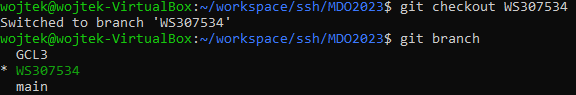

- W katalogu właściwym dla grupy utwórz nowy katalog, także o nazwie "inicjały & nr indeksu" np. KD232144
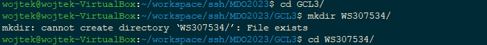

- W nowym katalogu dodaj plik ze sprawozdaniem
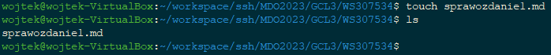

- Dodaj zrzuty ekranu
Zrzuty ekranu zostały przeniesione za pomocą sftp i komendy "put -r <nazwa_katalogu>" co oznacza rekursywne przeniesienie plików

Następnie edytujemy sprawozdanie za pomocą edytora np. nano i dodajemy zdjęcia w formacie markdown

- Wyślij zmiany do zdalnego źródła
Aby wysłać zmiany na serwer, najpierw musimy utworzyć commit. Aby tego dokonać dodajemy pliki, które mają zostać zawarte w tym commicie za pomocą komendy "git add <plik>" lub z parameterm "-A" jak chcemy dodać wszystkie pliki.
Za pomocą komendy "git status" możemy zobaczyć które zmiany zostaną zawarte w commicie.
Następnie tworzymy commit komendą "git commit -m "krótka informacja o zmianach""

Nowo utworzony commit jest dostępny jedynie lokalny, aby go wysłać na serwer używamy następującej komendy (parametr --set-upstream jest używany jedynie gdy po raz pierwszy robimy push dla danej gałęzi):

- Spróbuj wciągnąć swoją gałąź do gałęzi grupowej
Aby wciągnąć naszą gałąź do gałęzi z której wyszliśmy, musimy przełączyć się na gałąź grupową (git checkout) a następnie użyć komendy "git merge <nazwa_gałęzi>"

- Zaktualizuj sprawozdanie i zrzuty o ten krok i wyślij aktualizację do zdalnego źródła (na swojej gałęzi)
Edycja pliku sprawozdania:
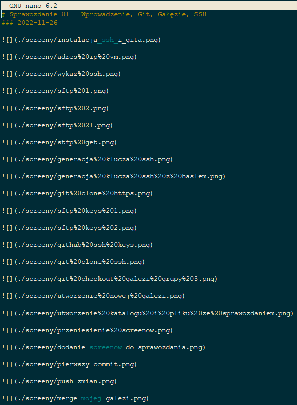

Dodanie zmian, commit oraz push (jak wyżej):
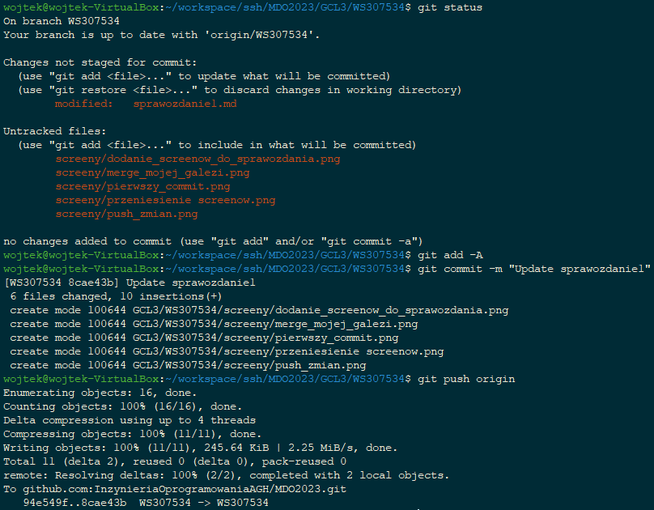

- Oznacz tagiem ostatni commit i wypchnij go na zdalną gałąź
Tag tworzymy komendą "git tag <-a/-l> <nazwa_taga> -m "wiadomość"" (w tym przypadku tag stworzony wcześniej stąd błąd)
Tagi tak samo jak commity należy spushować aby były widoczne na serwerze -> git push --tags
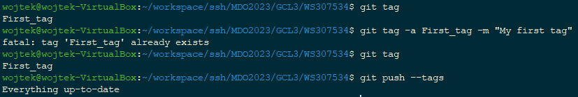

- Ustal hook, który będzie sprawdzał, czy wiadomość z commitem zawiera nazwę przedmiotu
Hooki możemy dodawać w folderze <glowny_folder_projektu>/.git/hooks.
Hooki mają predefiniowane nazwy plików w których znajduje się skrypt wykonujący nasze polecenie.
Aby sprawdzić wiadomość commita, posłużymy się plikiem o nazwie "commit-msg". Na wstępnie należy go utworzyć w katalogu hooks/ i dodajemy uprawnienia rwx za pomocą komendy "sudo chmod 700 commit-msg"
Następnie dodajemy implementację sprawdzającą czy commit message zaczyna się od prefixu "DEVOPS: "
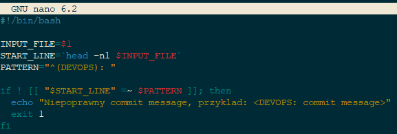

Następnie dodajemy testowy plik i próbujemy go zakomitować bez dodania prefixu w commit messagu aby zweryfikować czy hook działa
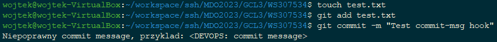

- W jaki sposób stworzyć hook, który będzie ustawiał prefiks wiadomości commitu tak, by miał nazwę przedmiotu?
Tym razem posłużymy się plikiem "prepare-commit-msg". Dodajemy taki plik do hooks/, dodajemy uprawnienia rwx a następnie dodajemy implementacje:
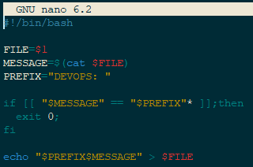
Skrypt pobiera jako argument nazwe pliku gdzie tymczasowo przechowujemy commit message, następnie sprawdza czy commit message zawiera w sobie wymagany prefix i dodaje go jeśli go nie ma

Zawartość testowego pliku:
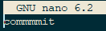

Z racji że parametrem tego skryptu jest nazwa pliku, to możemy go przetestować w ten oto sposób:
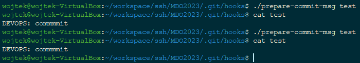
