1. Zainstaluj Docker w systemie linuksowym

    Wykonano w ostatnim sprawozdaniu
2. Zarejestruj się w Docker Hub i zapoznaj z sugerowanymi obrazami

    Wykonano w ostatnim sprawozdaniu
3. Pobierz hello-world, busybox, ubuntu lub fedorę, mysql
    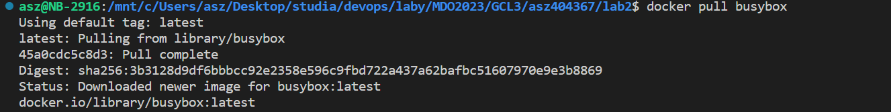
4. Uruchom busybox
   - Pokaż efekt uruchomienia kontenera
        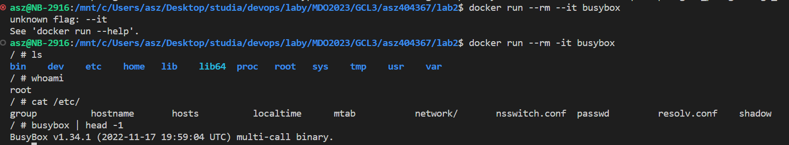
5. Uruchom "system w kontenerze"
   - Zaprezentuj PID1 w kontenerze i procesy dockera na hoście
        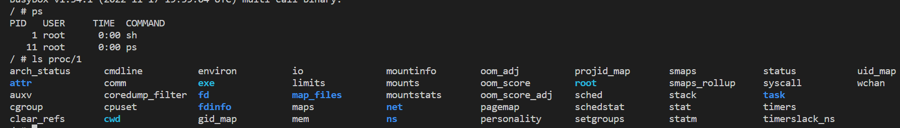
        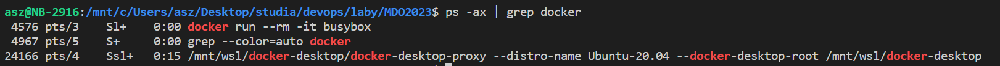
6. Pokaż uruchomione ( != "działające" ) kontenery, wyczyść je.
        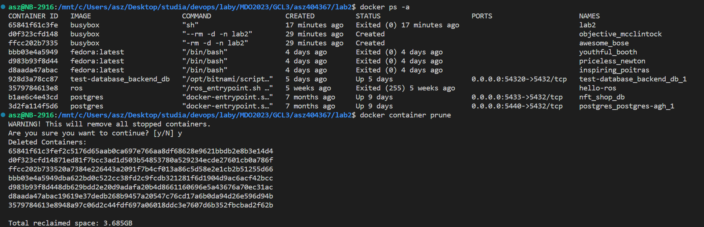
7. Wyczyść obrazy
        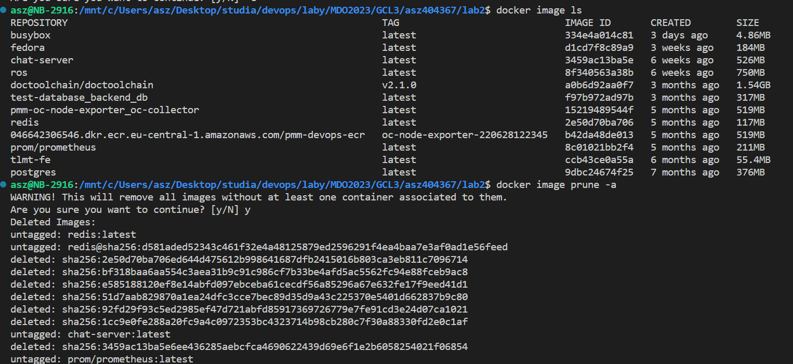
        Wyczyszone obrazy
        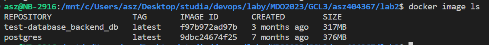

## Budowanie programu
1. Znajdź projekt umożliwiający łatwe wywołanie testów jednostkowych
        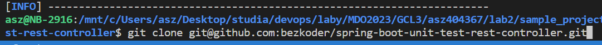
2. Przeprowadź budowę/konfigurację środowiska
        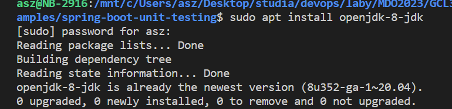

        Sklonowaną aplikacje zbudowano przy pomocy ./mvnw compile

    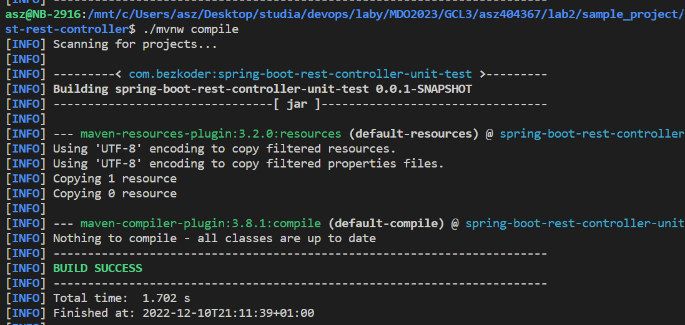

3. Uruchom testy
        Testy uruchomiono przy pomocy ./mvnw test
        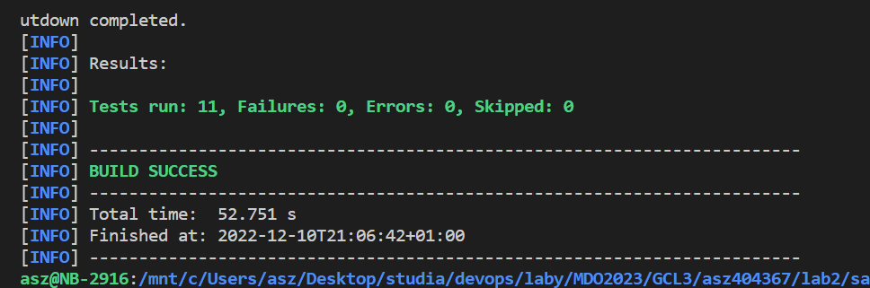
4. Ponów ten proces w kontenerze
   - Wybierz i uruchom platformę
        Stworzone bazowy dockerfile bazujący na ubuntu jammy

        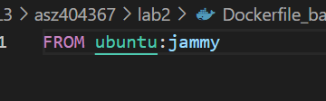

        Zbudowano go i otagowano jak lab2_base

        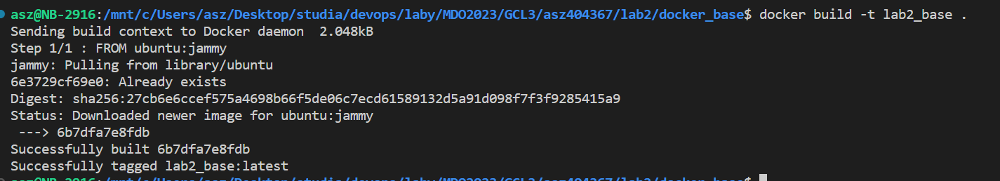

     Uruchomiono i zalogowano sie do kontenera przy pomocy
        docker run --rm -it lab2_base
   - Sklonuj aplikację, Skonfiguruj środowisko i uruchom build, Uruchom testy
        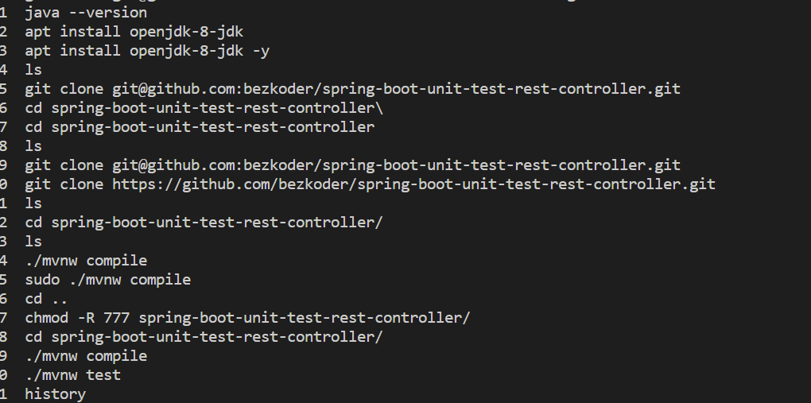
5. Stwórz Dockerfile, który ma to osiągnąć
    Stworzono Dockerfile, który bazuje na lokalnej obrazie, który otagowano jako "lab2_base", dodano do niego kroki, które wykonano manualnie w poprzednim punkcie
        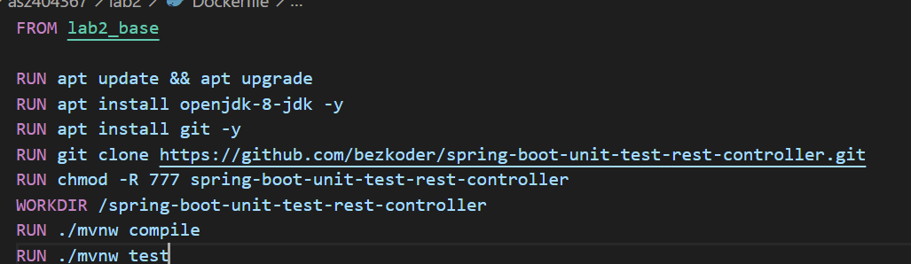

        Obraz zbudowano komenda "docker build -t punkt4"
        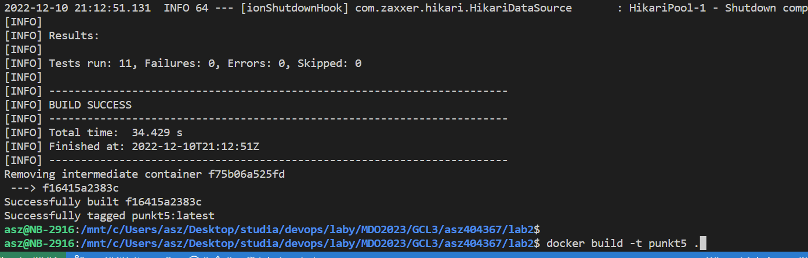

7. Na bazie obrazu utworzonego poprzednim dockerfilem stwórz kolejny, który będzie uruchamiał testy
 	* Kontener pierwszy ma przeprowadzać wszystkie kroki aż do builda
        Ten kontener znajduje sie pod sciezka lab2/punkt8/build_docker
        Bazuje on na obrazie lab2_base i przeprowadza wszystkie kroki co w pt5, tylko, do builda
        
        Obraz otagowano jako "build_base" 

        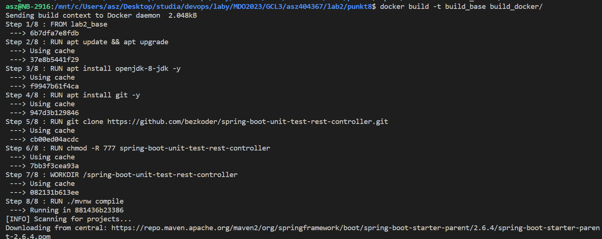

	* Kontener drugi ma bazować na pierwszym i wykonywać testy
        Dockerfile tego obrazu znajduje sie pod sciezka lab2/punkt8/test_docker
        oraz uzywa jako obraz bazowy obraz "build_base"

        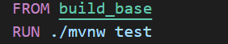

        wynik zbudowania obrazu

        
        

