# Wprowadzenie, Git, Gałęzie, SSH
1. Będę pracować na wsl z systemem UBUNUTU Focal co można zauwazyc na ponizszym screenie

2.  Na systemie znajduje sie juz klient git oraz program do generowania kluczy ssh, co widac na ponizszych screenach
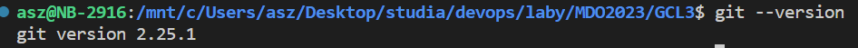
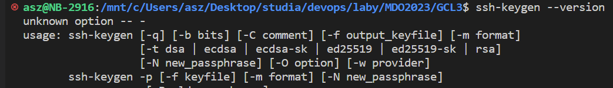
3. Nastepnie wygenerowano 2 pary kluczow ssh zaszyfrowanych protokolem ed25519, z czego jedno z nich posiada dodatkowo haslo

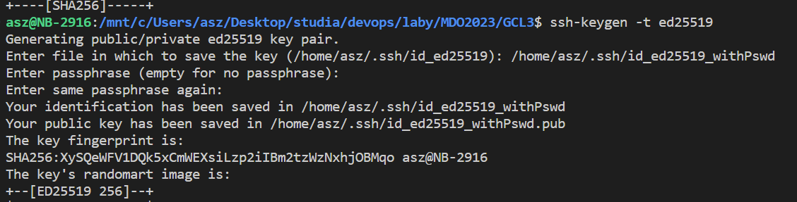
4. Nastepnie skonfigurowano zdalny system kontorli wersji tak aby korzystal z pierwszego klucza publicznego, poprzez doanie do ssh-keys w ustawieniach konta

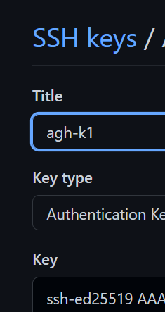

oraz skonifgurowano git config projektu,tak aby uzywal drugiej pary klucza

co można sprawdzić pod .git/config projektu

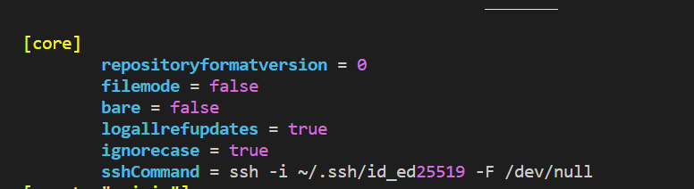.

5. W moim przypadku przed krokami 1-4 zmieniłem branch na gałąź *lab3* przy uzyciu komendy git checkout lab3, a nastepnie stworzyłem nowa gałąź przy uzyciu komendy git checkout -b asz404367

Nastepnie wykonano commita z nowy kluczem ssh - clona zrobiono jeszcze z starym kluczem, który miałem już skonifgurowano.

Nastepnie zmergowano stworzony branch do lokalnej galezi LAB3 
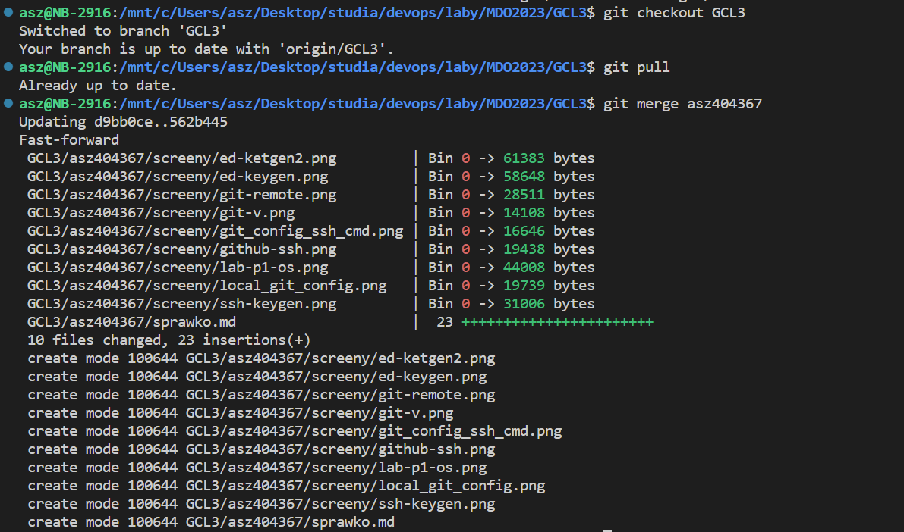.

## Hook sprawdzajacy, czy commit zawiera nazwę przedmiotu.
    .git/hooks/commit-msg hook przyjmuje jeden parametr, który jest ścieżką do pliku tymczasowego zawierającego wiadomość commita. Git przerwie proces commitowanie, jeśli skrypt zakończy się wartością różną od zera.

 Zanim zostanie stworzony commit git uruchomi skrypt pre-commit znajdujacy sie w lokalnym repozytorium pod .git/hooks . W tym hooku napisano logike sprawdzajaca czy commit zawiera nazwe przdmiotu
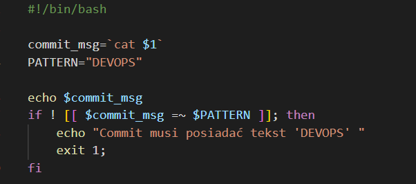.

Test hooka

## Hook ustawiajacy prefiks do commitu

Do tego zadania mozemy wykorzytac hook pre-commit-msg, w którym dodamy prefiks devops, jesli nie istnieje.

    Prepare-commit-msg hook jest uruchamiany przed uruchomieniem edytora komunikatów zatwierdzania, ale po utworzeniu commitu. Pozwala edytować domyślną wiadomość, zanim zobaczy ją autor. Hook pobiera kilka parametrów: ścieżkę do pliku, w którym znajduje się dotychczas commit, typ commitu i SHA-1 commitu, jeśli został zmieniony.Hook jest przydatny w przypadku zatwierdzeń, w których domyślna wiadomość jest generowana automatycznie.

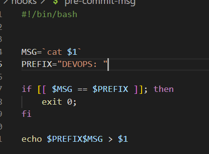.

Przykład działania hooka pre-commit-msg

Skryptą prepare-commit-msg oraz commit-msg dodano uprawnienia wykonywalne.

# Weryfikacja działania środowiska konteneryzacji

1. Instalacja dockera

    Ze względu na to, że pracuje na wsl2 musiałem zmienić ustawienie w docker desktop tak,aby uzyć docker-engine, którego miałem zaoinstalowanego na komputerze

    
    
    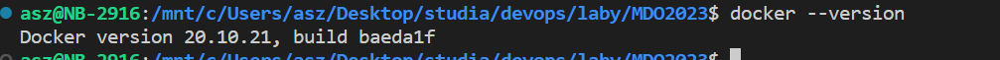
2. Działanie środowiska
    Pobrano obraz fedora w wersji latest 
    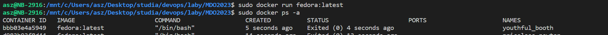
3. Utworzono konto na dockerhub oraz dodano 2FA po czym wygenerowano token przy pomocy, ktorego zalogowano się z poziomu cli na stworzone konto.

    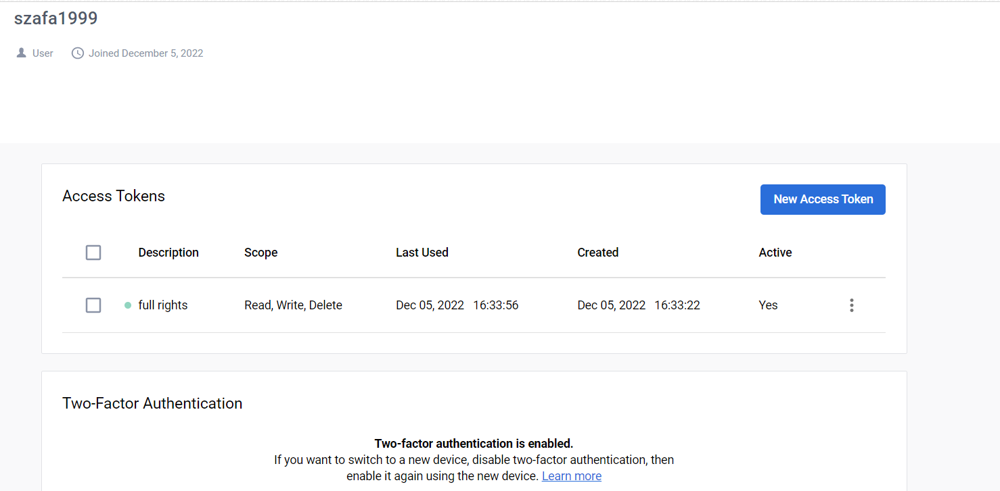
    

